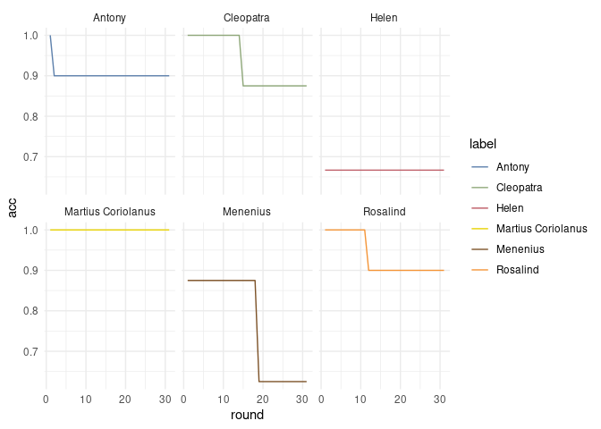

### Curves-under-keywords

A simple, but not data-hungry approach to character distinctiveness:

1.  Calculate “keyness” for Character A vs “Others” in a drama
2.  Arrange top *N* keywords by amount of “keyness”
3.  Calculate the area under the curve. Guys who would have flatter
    curve decays are probably more distinctive (more words that describe
    them). That is it. That is our *d* measure.

For keyness here I use \[weighted log-odds\]
(<https://bookdown.org/Maxine/tidy-text-mining/weighted-log-odds-ratio.html>),
but in principle anything will do.

Legit characters are filter at *w**o**r**d**s* \> 2000. In each log-odds
calculation we upsample Character to “Other” lengths (probably will redo
it to proper bootstrapping Ben’s-way)

*N* keywords cut-off is 100 for every character (even if there is a tie
in log-odds rank).

The main script for analysis is `03_logodds_curves.R`, functions sit in
`src/loo_distinct.R`.

### Cleopatra & Anthony

Here is an example: Cleo girl has more distinctive words with values
above the Anthony. Her area-under-curve would be of higher value.

``` r
df_fin %>% 
  filter(playName=="antony-and-cleopatra") %>% 
  filter(label %in% c("Antony_1", "Cleopatra_1")) %>%  ggplot(aes(rank,log_odds_weighted,color=label)) + geom_path() + theme_minimal() + scale_color_paletteer_d("wesanderson::Darjeeling1") + labs(x="word distinctivness rank")
```


### Bags of words

Good news is that together with distinctiveness measure *d* we also have
the corresponding words. Here are top 30 keywords per character, 50 top
distinct characters from the whole corpus.

``` r
labs <- df_fin %>% left_join(meta %>% select(playName,firstAuthor),by="playName") %>% group_by(label,d) %>% top_n(30,log_odds_weighted) %>% group_by(label,playName,firstAuthor,corpus,d) %>%   summarise(bag=paste(word,collapse = "_")) %>% group_by(corpus)  %>% top_n(50,d) %>% arrange(corpus)
```

    ## `summarise()` has grouped output by 'label', 'playName', 'firstAuthor',
    ## 'corpus'. You can override using the `.groups` argument.

``` r
knitr::kable(labs)
```

| label                           | playName                                  | firstAuthor               | corpus |        d | bag                                                                                                                                                                                                                                                                                                                                                                                                                                                        |
|:----|:-----|:----|:-|--:|:----------------------------------------------------|
| Adélaïde_2                      | maintenon-conversations                   | Maintenon                 | fre    | 313.5666 | elle_la_foi_messager_cultiver_retourne_éléonore_attend_considération_moeurs_laffaire_personneslà_bonne_ingratitude_laugmenter_rendais_adoucir_nadoucisse_protègent_torts_appelé_chères_pourrionsnous_sable_compreniez_sacheter_soublie_peut_bienfait_délassements_horreur_impraticables_intéresser_prémédité_reçoivent_remettre_songent_soyonsle                                                                                                           |
| Alcidon_5                       | desmarets-visionnaires                    | Desmarets de Saint-Sorlin | fre    | 240.4804 | delle_rebuter_ferez_lysandre_mest_sil_contenter_questce_promesse_richesse_est_dieux_bienveillance_préférable_retirezvous_croyais_lappeler_maisons_vaillance_alliance_défense_entendu_lamitié_lépouvante_osentelles_pourvoir_précipice_refuge_vouloir_gendre                                                                                                                                                                                                |
| Alciron_1                       | urfe-sylvanire                            | d’Urfé                    | fre    | 250.5882 | tirinte_crime_glace_supplices_aidemoi_forfait_selon_tribunal_prudence_désordres_présenté_lui_ménandre_approche_finesses_genoux_personnes_tiensla_crimes_fuseau_misères_pressé_relevonsla_souriait_suivi_la_bourbiers_fontelles_lauteur_loccasion_remettrai_souhaité_torpille                                                                                                                                                                               |
| Alfred_2                        | constant-wallstein                        | Constant                  | fre    | 248.6317 | vous_votre_pure_mon_illustre_mienne_tournez_coeur_misérable_verser_visage_père_daucun_lantique_quavonsnous_abuse_contienne_croyait_nastu_purs_saintes_viendrait_engagezmoi_naperçoit_ninterroge_puisque_quallezvous_renfermés_rétractez_unissezvous_veillant_vérité                                                                                                                                                                                        |
| Amerine_1                       | scudery-ligdamon-e-lidias                 | Scudery                   | fre    | 252.3690 | heureuse_te_infidélité_jirai_ton_vaten_coutume_ta_cherchant_jalousie_ordinaires_remis_tavait_croissant_dyeux_tourmente_abandonnée_abusé_chéri_doreilles_issue_conte_disaistu_enceinte_exécuté_manquât_mestimant_nastu_retenez_reviendrait                                                                                                                                                                                                                  |
| Antoine_8                       | turnebe-contents                          | Turnèbe                   | fre    | 261.9728 | maître_maria_dépourvue_églises_sa_passera_aviserons_personnes_réconcilier_cognée_essaye_jouait_la_enseignes_harnois_masquer_tamuseraistu_donnent_feraistu_friande_gervais_lattendez_ôter_putain_auriezvous_avançonsnous_baise_consommer_craintif_dalléger_trouvais                                                                                                                                                                                         |
| Argire_3                        | du-ryer-cleomedon                         | Du Ryer                   | fre    | 239.2039 | perdu_son_cherché_fisje_vif_fils_lavait_reçut_fertile_jemployais_joubliai_feinte_neusseje_première_promesses_couronné_portais_teût_conquérant_ébranlé_race_rendît_apprendre_confidence_consume_donnai_homicide_jélève_quy_saffranchir_séloignant_sortir                                                                                                                                                                                                    |
| Astérie_1                       | corneillet-circe                          | Corneille                 | fre    | 250.7349 | autrement_dira_ça_naurait_semblent_prude_déploie_présents_trouvez_étude_nous_querelle_lordinaire_reblanchir_venait_comme_baise_nes_pruderie_retenue_soupirants_terrible_confident_daffaires_enragent_métier_mûrs_noser_chercherait_entretenue_faudra_faune_mouvement_parlerait                                                                                                                                                                             |
| Baron_8                         | sand-moliere                              | Sand                      | fre    | 279.5309 | vous_mon_fallu_dort_moitié_mordonner_amoureux_guérit_lignoble_raillé_sourit_élomire_madame_convenu_dendurer_riez_adieu_écrivais_alarme_coin_fraîchement_parjure_pleurent_recherche_rient_sentir_sollicitude_soupçon_armande_couché_dormiez_douté_lannonce_mempêcher_renvoyezmoi_reprenne_respectez                                                                                                                                                         |
| Béralde_1                       | moliere-malade-imaginaire                 | Molière                   | fre    | 244.1506 | vous_frère_de_robe_lerreur_saccommoder_devient_profitent_les_danses_défaire_expédiera_détachée_des_qui_conversation_embéguiné_enseveli_gâte_prévention_rencontré_savant_tend_vouliez_épais_humaine_instruira_loin_pièges_présente_quentre_raisonlà_rétablir_voudrez                                                                                                                                                                                        |
| Cassandre_19                    | schelandre-tyr-sidon-ii                   | Schelandre                | fre    | 243.5884 | deusséje_parmi_devint_inhumain_mait_col_couchez_couvé_paupière_changements_doucement_éclats_éminente_floquets_glacée_légers_maudit_charrette_chastes_chevelure_fleurettes_injures_nue_spacieux_me_aiguisez_aînée_damourettes_dépit_déplante_devenue_fidèles_nonobstant_refrongné_suppliant                                                                                                                                                                 |
| Chasteaufort_1                  | cyrano-pedant-joue                        | Cyrano                    | fre    | 245.1375 | court_en_je_chien_jaurais_poltron_sois_content_damne_courir_perdirent_tomber_si_déchira_dépêchetoi_ingrat_allongé_bile_désarmé_bélître_quarté_verra_marqué_ouvremoi_garde_dangereusement_hercule_jallais_mempêcher_poètes_poursuis_sept_tempérament                                                                                                                                                                                                        |
| Clotilde_1                      | aure-genevieve-70                         | d’Aure                    | fre    | 247.4439 | vous_consoler_chênes_bénite_lunivers_abattus_conspirer_hôtel_aviserons_bénédictions_écouterai_heureusement_juger_bien_combats_concubinage_danger_jentends_pouviez_accompagner_avancer_barbare_daccueillir_eux_pouvaient_puisquon_attendezmoi_concubine_devis_faisiez_fermement_fortement_incapable_inquiétude_irrémissible_lentendezvous_luisant_prendrons_rapporté_rayons_remédier_urgande                                                                |
| Corbineli_1                     | cyrano-pedant-joue                        | Cyrano                    | fre    | 278.7848 | votre_vous_il_lordre_question_nous_cam_dormir_parlez_constantinople_nesle_lui_démêlement_desseins_navire_touchant_choqué_condamner_ébaucher_fils_colloquez_pèse_soppose_tournée_ont_chrétienté_décus_dérober_mécoutiez_mufti                                                                                                                                                                                                                               |
| Crésus_1                        | boursault-esope                           | Boursault                 | fre    | 256.7161 | ton_tu_te_rat_abus_sortez_me_éclate_toimême_test_astu_maiment_tes_joint_lordonne_loue_je_bras_trouvant_conjure_contents_criminel_tien_ta_zèle_lemporte_lheure_peux_réformer_repentit_rompre_taccuse_tache_tâche                                                                                                                                                                                                                                            |
| Crispin_2                       | dancourt-chevalier-a-la-mode              | Dancourt                  | fre    | 245.6722 | haie_poète_diable_manqué_fâchez_barbet_justaucorps_mémoire_envie_commission_lamusez_sortons_trente_attend_craignezvous_porteur_essayât_monsieur_expliqueriez_làdessous_lièvre_vaudrait_les_arrive_dedans_pende_portierlà_ravies_écurie_interroge_jeannetonlà_lavaisje_lexcellent_mîmes_saisje                                                                                                                                                              |
| Dorice_1                        | baro-celinde                              | Baro                      | fre    | 251.9081 | apporter_punition_légère_principal_ancêtres_exemplaire_plusieurs_sempêcher_violente_quelque_fameux_voisins_tire_conseillé_dhomicides_informée_naurez_oublier_proposé_venge_célinde_de_approche_constitué_embrasse_icibas_mourons_plains_plu_puisquelle_suivant                                                                                                                                                                                             |
| Eustache_2                      | turnebe-contents                          | Turnèbe                   | fre    | 239.8580 | cousin_fardée_atteint_renvoie_préjudice_cabinet_je_père_attifées_gentilly_rené_dînera_duquel_cousine_parlaient_tout_ballet_étourdi_fûmes_mâle_pourpoint_semblable_auraisje_courroux_drogues_lentendras_paierai_sauvée_soupçonner_trouvât_vîtesvous                                                                                                                                                                                                         |
| Floridan_1                      | baro-celinde                              | Baro                      | fre    | 259.6219 | quest_madame_félicité_parthénice_médiocre_quentre_sapproche_certains_vous_cède_dattirer_dépouillé_imposer_insolent_obstination_opiniâtreté_admirable_content_eue_paru_résignation_sot_vertueuses_ajoutatelle_aurai_avantageusement_aveugle_consentirai_exaucés_jexpire_mettant_sagesse                                                                                                                                                                     |
| Fontignac_1                     | marivaux-ile-de-la-raison                 | Marivaux                  | fre    | 309.5502 | jé_dé_lé_né_mé_cé_qué_bous_cadédis_sandis_maîtré_té_hommé_emvarras_pétit_céla_boilà_commé_hochet_régarde_régardez_cetté_fortune_navezvous_bésoin_discours_fourbe_taillé_dégré_entré_faisais_imvécile_sé_touté_votré                                                                                                                                                                                                                                        |
| Fossinde_1                      | urfe-sylvanire                            | d’Urfé                    | fre    | 270.7648 | satyre_saute_demeurer_irai_inimitié_libéral_retourne_jaie_laide_écho_os_fruit_ronces_temporte_proverbe_romponsles_détachemoi_peuton_cauteleux_informés_retentons_viendratil_altières_dalarmes_furie_idolâtre_montagnes_je_âpres_brouillon_décevant_double_précipices_senfuirait_tranchante                                                                                                                                                                 |
| Frosine_6                       | moliere-avare                             | Molière                   | fre    | 244.6470 | elle_vaut_consenti_blondins_dadresse_talent_lâge_quaux_délicatesses_haine_marquise_an_céphales_eussiez_ragoût_aviez_charmants_compte_daccoupler_dîné_entretenues_fièvre_pâte_sobriété_aversion_avertie_lart_libre_mettons_récit_salade_venise_voudriez                                                                                                                                                                                                     |
| Gareau_1                        | cyrano-pedant-joue                        | Cyrano                    | fre    | 366.2855 | bian_vêla_étet_eune_fisje_ous_queuque_sis_escousse_ol_quoui_avet_itou_ardé_jaquelaine_monsieu_quous_fitil_denis_eun_tanquia_da_pus_enfans_biau_païs_guieu_parguene_vrament_queuquun                                                                                                                                                                                                                                                                        |
| Genevote_1                      | cyrano-pedant-joue                        | Cyrano                    | fre    | 291.0009 | souhaiterais_son_de_dormi_lambeaux_plaisant_le_col_doublure_blasonner_décrottoires_manda_commença_entreprise_pois_salomon_vêtement_accusez_avare_chapitres_combien_dappréhender_décharger_deviner_dheure_étage_feint_manquer_peau_prairies_remontant_reviendrai_soffenserait_vont                                                                                                                                                                          |
| Géraldin_1                      | constant-wallstein                        | Constant                  | fre    | 262.7625 | vous_trompez_semée_daujourdhui_lenteurs_lever_sapaient_ziska_servez_tôt_craindront_croyaient_éclairé_ouvrir_rebelle_insulte_lentremise_lestime_nattend_nuremberg_partis_rendît_ferdinand_danube_démêlant_détacher_entrevoit_hésiter_souvrait_suffira_venus                                                                                                                                                                                                 |
| Girard_2                        | turnebe-contents                          | Turnèbe                   | fre    | 239.7642 | tu_il_liberté_loreille_commère_rigueur_te_offres_pères_plaisante_appartient_volage_adultère_conjoint_prennes_eustache_pas_différer_dôter_forçat_laissions_seconde_ceuxci_corbeaux_dépucelée_fallût_faudrail_marié_pardonnera_répondre_tandis                                                                                                                                                                                                               |
| Henri_8                         | mercier-destruction-de-la-ligue           | Mercier                   | fre    | 266.3012 | rosni_je_que_pourrai_dispose_férocité_mes_le_la_avancer_cessera_combattre_obligé_royauté_fantastique_fermeté_siècle_tueront_endurcir_épargnons_jindiquerai_nation_ombre_rendent_abondance_deviendront_pointenotredame_répéter_secouera_de                                                                                                                                                                                                                  |
| Hilaire Fils_1                  | mercier-destruction-de-la-ligue           | Mercier                   | fre    | 241.2022 | appartient_père_disputons_retenez_transport_vengeance_accourt_désarmer_pensées_hâté_léprouver_lancy_abominables_croyons_disent_opiniâtre_mère_affable_assiégeants_errer_extrémités_interminables_juge_leffroi_pontificaux_précieuse_restais_réunis_réunissant_réveiller_sceptre_spectateurs_trompeuses                                                                                                                                                     |
| Hylas_4                         | urfe-sylvanire                            | d’Urfé                    | fre    | 252.2144 | dhylas_maîtresse_animaux_pensent_amante_envie_cherchons_combler_noeud_nouveaux_aglante_farouche_te_despérance_furent_nétaitce_chaud_maigres_souffrions_taura_céladon_hurler_murmurer_parlez_nous_carlis_changements_choisirais_quitte_rapporteront_surprendre                                                                                                                                                                                              |
| La Marquise_37                  | musset-lorenzaccio                        | Musset                    | fre    | 297.3115 | laurent_pensées_enfin_faitesle_lire_que_inexplicable_pelouse_promène_non_tu_maccuse_bénissezmoi_religieux_tremblante_toi_blanchâtre_jespère_lusage_représentent_assemblages_contraires_lesclavage_nimporte_perversion_servez_mais_malaspina_brûlantes_chasteté_donnera_écho_héritage_jourlà_mattire                                                                                                                                                        |
| Le Cardinal_2                   | musset-lorenzaccio                        | Musset                    | fre    | 333.3044 | marquise_vous_chaîne_saura_armure_compris_agnolo_apprenezle_confessionnal_apparence_conduire_repose_sept_dirais_nonchalant_patriotisme_connaissezvous_jules_presser_rudes_sonne_votre_chevelure_laconique_senferme_cercle_costume_folie_mavez_mexcuser_mobéissant_sattend_signora_souvenezvous_tuetête                                                                                                                                                     |
| Le Duc_16                       | musset-lorenzaccio                        | Musset                    | fre    | 307.0113 | donc_tenait_hongrois_maiment_allons_renzo_pardieu_gabrielle_brillant_porterais_ces_dexplications_éveillé_renzino_lanterne_surtout_morceau_aiguë_figures_louable_précipités_regardezmoi_texcommunie_vertgalant_voisinelà_ici_emporter_fluettes_illusion_provoquer                                                                                                                                                                                           |
| Le Roi_1                        | aure-dipne                                | d’Aure                    | fre    | 243.2029 | vaten_lhabille_traître_navaisje_dague_forfaits_ma_faitil_sanglantes_souffrirais_dipné_ton_moi_dénaturé_obéir_contrains_démarrer_dispense_percé_punir_relever_soulage_vivait_va_ô\_déloyal_dirastu_jalouse_laffront_meurtrir_sujette                                                                                                                                                                                                                        |
| Madame de Saint-Genis_1         | becque-corbeaux                           | Becque                    | fre    | 248.0290 | méfiezvous_fils_mon_compliqué_sontils_compromis_mademoiselleblanche_pécuniaires_associé_monsieurlenormand_oublier_quelquun_réflexion_vous_inconséquence_recevrais_suivrait_déclarer_lapport_je_boulanger_court_incompréhensible_minterrompez_misérable_mode_piquent_rare_risquerais_abuser_cédé_confierait_convives_éprouvent_fâchée_gêner_généreusement_lenleviez_lentends_monsieurtestelin_nattache_paraître_réduiront_répéter_rompu_séductions_soupçons |
| Madame de Vertillac_1           | diderot-est-il-bon-est-il-mechant         | Diderot                   | fre    | 241.2373 | lavez_mentez_intendante_soir_traduit_passions_raconte_aucune_éloignezvous_journées_polis_ditesvous_forte_lenferme_parlerons_répondez_retirezvous_figure_mimporte_partout_cesseratil_logetil_ly_mattendiez_veuxtu_vieillir_causez_connois_dauberge_dennui_éternelles_interrompre_meurs_permettrai_retournons_superflues_théologien                                                                                                                          |
| Marie_1                         | becque-corbeaux                           | Becque                    | fre    | 249.0489 | chérie_allezvousen_ma_monsieurdubois_tu_acquitté_monsieurteissier_attention_couturière_dernière_dimpatience_mère_chargée_laimais_monsieur_bravement_mattendais_sois_arrièrepensée_conseilleriez_dégoûts_delle_déraisonne_lavantage_obtiendrait_paix_preniez_reprenaient_résolutions_senstu_sortes_suffisante_suivez_taime                                                                                                                                  |
| Mélinde_4                       | mareschala-soeur-valeureuse               | Mareschal                 | fre    | 239.6309 | fus_linjure_publier_servi_surmonter_dérobent_disputer_épanchez_laccès_ny_rougirait_fuyons_lépargnerez_nosait_rendstoi_mefforce_piété_venus_contentezvous_excusable_hardie_malicieux_odieuse_soustraite_empêcher_éprouvée_impourvue_lambition_livré_longueur_permettrezvous_profit_ressentiments_ruisseaux_supposions_vaincue                                                                                                                               |
| Ménandre_5                      | urfe-sylvanire                            | d’Urfé                    | fre    | 276.0914 | fille_théante_logis_père_largent_attraits_lépouse_miennes_leusses_incommodités_jeunesse_partis_bientôt_inexperte_nauront_changés_lordonnez_ten_disais_finirait_année_ferait_maisons_prudente_combien_quelle_bénins_courroucé_défautil_saouleraient_tontils                                                                                                                                                                                                 |
| Paquier_1                       | cyrano-pedant-joue                        | Cyrano                    | fre    | 245.1061 | feu_vous_ira_jeunes_traits_puissestu_monsieur_absous_assurément_parents_compositum_navrez_trahir_caquet_feindre_luit_dirai_livrogne_paiement_particularité_car_que_arderez_commandé_connaissez_dédain_met_miroir_optât_quayant_rapporte                                                                                                                                                                                                                    |
| Pharnabaze_3                    | schelandre-tyr-sidon-ii                   | Schelandre                | fre    | 241.0161 | sevère_verray_eternelle_vengé_calme_ès_prodiges_droict_lignée_tambours_toiles_courageux_desperer_nuisait_pareils_non_ampoulées_brutaux_croitil_défense_deffroyables_dependre_despend_diras_écrasé_jenvoye_nas_nauroije_piquée_portant_reduire_sappuient_soitil_somptueux_sons                                                                                                                                                                              |
| Pierrette_3                     | sand-moliere                              | Sand                      | fre    | 299.2457 | ça_oh_tenir_dame_brin_bien_vous_ouida_blés_devenez_avertir_habillé_nentends_monsieur_asseyezvous_on_bah_chaque_malice_nenni_serrez_comme_mamselle_voilà_occuper_dit_aimons_cotillon_douze_manches_midi_ravisez                                                                                                                                                                                                                                             |
| Rodomont_3                      | turnebe-contents                          | Turnèbe                   | fre    | 248.5302 | nivelet_flamberge_rendrai_armés_cuirasse_poignée_daussi_épaules_étranges_têtes_tuer_bouclier_lestoc_roland_bouge_brun_darmes_davis_bataille_corporal_signe_volé_armée_commandezmoi_troupe_victorieux_quils_batailles_fifres_jusquau_laventure_nentreraije_pique                                                                                                                                                                                            |
| Satyre_3                        | urfe-sylvanire                            | d’Urfé                    | fre    | 331.6182 | fossinde_invincible_amers_jouer_crie_fillettes_fossette_jouent_lavait_tu_épingles_délicatesses_noisettes_jouvenceaux_poil_ne_fondre_pommone_tournes_ces_humeurs_apparences_choisissent_puissestu_tavais_isoure_jambe_puisquétant_aillent_aise_cornue_daims_gardons_lémeut_meuble_mignonne_nentendons_nommez_portent_quuser_tapproches                                                                                                                      |
| Sempronius_1                    | boyera-caton                              | Boyer                     | fre    | 243.1507 | gronde_conspiration_traîtres_rendrait_exécution_lâches_modération_promptement_trembler_secoue_hasard_répandaitil_factieux_sensible_signe_nous_brisera_conquête_demain_franchit_miens_pluton_projet_proserpine_torride_toucher_dépêcher_inquiets_malgré_nembrasser_nouveaux_retardement_souffrira_tremper                                                                                                                                                   |
| Silvie_4                        | scudery-ligdamon-e-lidias                 | Scudery                   | fre    | 246.9013 | mimportune_ligdamon_onde_alcidor_lherbe_languir_maimais_mavez_émanciper_chasser_fraîcheur_savait_toblige_changement_frais_insensibles_rencontrent_servait_traitant_aurez_chant_consens_danémone_désobliger_effroyables_estce_rire_sêtre_tendre_tranquille                                                                                                                                                                                                  |
| Suzanne_6                       | zola-therese-raquin                       | Zola                      | fre    | 242.0759 | lunette_têtes_cheminées_terrasse_vous_pots_oncle_des_dapproche_saintsulpice_moindres_devenu_épingle_revenant_aider_dirais_mignon_ait_allés_caverne_dardoises_denfants_imagineriez_marié_nuages_baissez_envie_vieillards_de_bleu                                                                                                                                                                                                                            |
| Sylvanire_1                     | urfe-sylvanire                            | d’Urfé                    | fre    | 257.6379 | tentends_fuyons_je_cléandre_père_mon_exempte_ma_allonsnous_aglante_discrétion_pardonnezmoi_que_vous_actions_témoins_réciproque_mère_épouser_me_chaste_décharger_laissonsle_meust_oseraije_arbres_honnêteté_insolent_parlent_doitelle_métal_questu_séchez                                                                                                                                                                                                   |
| Teissier_1                      | becque-corbeaux                           | Becque                    | fre    | 246.7074 | vous_bourdon_retrouver_dépenses_vouliez_votre_facilement_gauche_joues_mentendez_pleurez_vos_destinée_ouvrage_généraux_droite_quarante_làdedans_mlle_amener_avancé_courantes_promptement_rendrez_tuer_vendue_blonde_campagne_cinquantaine_concession_économiser_étendu_français_lapprendre_logé_madameteissier_rangs_rentre_sensée_vérifiera_village                                                                                                        |
| Thécla_1                        | constant-wallstein                        | Constant                  | fre    | 259.5252 | mon_alfred_seule_mattend_mère_je_père_époux_pars_funèbre_me_souffrez_trompeurs_ne_attendre_mouvement_tombeau_élise_respirer_défends_maurait_nuages_quici_séduira_sétait_terme_courons_finis_impitoyables_menacés_paru_quitterais_serre                                                                                                                                                                                                                     |
| Tirinte_2                       | urfe-sylvanire                            | d’Urfé                    | fre    | 253.2159 | offre_limportune_devraije_jusquoù_entreprise_vous_jugée_retardons_séloigne_bergère_mon_allons_aimant_çen_désarmer_obligation_pensées_pièces_tristes_heureux_alciron_abîmes_desprit_laccident_laissais_orage_sylvanire_autel_crédule_laimé                                                                                                                                                                                                                  |
| Amalia_3                        | schiller-die-raeuber                      | Schiller                  | ger    | 336.5486 | rock_liebenden_hektor_götter_karl_ehrwürdig_zeuch_mordend_hektors_schämt_speere_zürnen_hörer_trauren_himmlisch_mittag_scheinen_überdulden_er_pflückte_liebe_rosen_fliehst_bedauerst_dahingehn_freistatt_lethe_schickten_anhat_meere_schlingt_xanthus                                                                                                                                                                                                       |
| Bonifatius_1                    | tieck-leben-und-tod-der-heiligen-genoveva | Tieck                     | ger    | 357.7483 | die_sie_kruzifix_und_liefen_er_brächte_selben_gerechte_magnus_erweitern_schlimmeren_erlitt_in_schieden_ärmsten_elfenbeine_freute_war_drachen_frühern_gereuen_ausgesehn_begann_bietet_felsenaltar_gesündet_herzogstochter_knieten_ora_seelmeß_während                                                                                                                                                                                                       |
| Chor gefangener Trojanerinnen_1 | goethe-faust-der-tragoedie-zweiter-teil   | Goethe                    | ger    | 397.8218 | dem_fühlen_schallen_blendende_geneigt_ach_uns_denn_gefangene_unsäglichen_gegönnt_befehl_ikarus_schmählichen_wir_einander_fürchterliches_gebildet_liebliche_beherrscher_verachtung_sie_aber_bestieg_cyprien_ragender_reben_wähnens_entzweitest_herzensdrang                                                                                                                                                                                                 |
| Denkerke_1                      | vischer-faust                             | Vischer                   | ger    | 325.4957 | mephistopheles_erbe_womit_aufzug_die_verehrten_zweie_personen_des_wechseln_unterbrechen_werke_uns_gelöst_künftigem_schmollis_noch_allumfassenden_sittlichen_urian_allegorie_stadium_wir_befleckt_d\_entstehung_fichte_pfand_zweiten_haben                                                                                                                                                                                                                  |
| Der Abonnent_1                  | kraus-die-letzten-tage-der-menschheit     | Kraus                     | ger    | 611.2625 | sie_no_bündnisses_vertiefung_sagen_des_in_ausbau_gerüchte_frankreich_nowogeorgiewsk_was_deutschland_zwischenhändlern_dadafür_zwangsweise_kolberg_glückwünsche_mitgewirkt_passet_eine_glückwunschtelegramm_haager_miserabel_schon_gelesen_teilnahme_aufhaltenden_die_auffassungen                                                                                                                                                                           |
| Der alte Biach_1                | kraus-die-letzten-tage-der-menschheit     | Kraus                     | ger    | 628.1000 | auslegung_die_in_treueste_und_den_der_kaiserin_des_schaute_diktiert_bündnisses_fassung_einbildungskraft_beschlüssen_communiqué_vielleicht_ist_sibyl_entente_rühs_vertiefenden_laienfragen_vorstellen_hertling_schwelgt_von_hineindenken_unterstützung_bohrt_undenkbar                                                                                                                                                                                      |
| Der alte Moor_1                 | schiller-die-raeuber                      | Schiller                  | ger    | 367.8608 | mein_sohn_brachte_mir_schreib_umfassen_blutige_du_gelebt_verzweifeln_ich_franz_meinen_wehe_tochter_menschliches_bat_sohne_o\_meinem_meine_wiedersehen_ersparst_unzärtliches_kind_maltest_umfaßte_oh_bring_fluche_frohe_nächten_zürne                                                                                                                                                                                                                       |
| Der General (V/55)\_1           | kraus-die-letzten-tage-der-menschheit     | Kraus                     | ger    | 732.1411 | herrn_wir_meine_schkribler_beispiellosen_und_antreiben_haben_planmäßig_diese_uns_also_truppe_maschingwehr_subversive_ruhmbedeckt_erblicken_unserer_elendigen_trinke_gagisten_nationalidäten_hintansetzung_die_dezimiern_borewitsch_das_auf_da_stäbe_vierjähriges                                                                                                                                                                                           |
| Der Jäger_2                     | tieck-prinz-zerbino                       | Tieck                     | ger    | 399.2035 | waldgesang_hörnerklang_zorn_ernste_jäger_wähnen_euch_hirsch_liede_wendet_bellen_trüb_horn_epilogus_durch_handlung_jagdlust_petersburg_wechselchor_jagd_tapfre_geschlossen_verliert_buße_diente_lenkest_ungern_erfrischt_mächtiger_schmach                                                                                                                                                                                                                  |
| Der kaiserliche Rat_1           | kraus-die-letzten-tage-der-menschheit     | Kraus                     | ger    | 804.3761 | sie_luzk_was_aber_no_sagen_braucheten_mir_das_is_wissen_tachles_ich_billig_untertitel_ham_ihnen_soll_also_wieso_sich_doch_wie_heut_heißt_man_blechen_imponiert_steht_schon                                                                                                                                                                                                                                                                                 |
| Der Nörgler_1                   | kraus-die-letzten-tage-der-menschheit     | Kraus                     | ger    | 330.0397 | die_als_und_der_quantität_zu_dem_ist_daß_menschheit_dieses_es_den_eines_dieser_schlimmer_schieber_würde_welt_tyrannen_schopenhauer_sondern_hätte_einem_tier_nicht_gegen_einer_motiv_verschärfung                                                                                                                                                                                                                                                           |
| Der Optimist_1                  | kraus-die-letzten-tage-der-menschheit     | Kraus                     | ger    | 468.0339 | sie_ist_die_kaiserdragoner_der_daß_krieg_opfermut_dnjestr_es_uszieczko_aber_glauben_nicht_heldenruhm_den_ihnen_nun_unterschätzen_doch_kurzem_in_jahresbericht_wäre_todesverachtender_von_bürgertheater_selbst_dankten_albanien                                                                                                                                                                                                                             |
| Der Patriot_1                   | kraus-die-letzten-tage-der-menschheit     | Kraus                     | ger    | 613.6210 | sie_wolldecken_man_sagen_no_is_was_hat_ausbau_katzenellenbogen_vertiefung_bündnisses_deutschland_er_sagt_in_gerüchte_gelesen_wissen_frankreich_packasch_vergleicht_anderhalb_berg_aber_kaiserzusammenkunft_konkurs_ham_sich_unwahr                                                                                                                                                                                                                         |
| Die Schalek_1                   | kraus-die-letzten-tage-der-menschheit     | Kraus                     | ger    | 588.6461 | tk_tiu_spagat_sie_wirklichen_ist_wu_ausguck_geputzt_namenlos_gewordenes_michele_gepackt_platte_wie_wonne_zertrümmerten_arbeitern_mich_à\_leutnant_schlimmeres_käfig_todesgefahr_zwischendurch_wohlgemut_befehl_eine_gänse_blaß_feindeshaß                                                                                                                                                                                                                  |
| Genovefa_1                      | maler-mueller-golo-und-genovefa           | Maler Müller              | ger    | 309.9177 | schmerzenreich_margaretha_starker_gelübde_künstlern_doch_amme_betrogen_ich_zeuge_freundlicher_gedankt_verlässest_aufbruchstunde_halleluja_nachtthau_häufens_schweigt_talenten_himmlisch_kindlein_popeyo_vergießen_auferzog_hoffst_lebest_himmel_gemahl_anspannen_flügelein_progressen_schaff_unstät_vorschläge_zetteln                                                                                                                                     |
| Gertrud_9                       | tieck-leben-und-tod-der-heiligen-genoveva | Tieck                     | ger    | 368.3542 | euch_sie_vergißt_ihr_es_sichrer_zu_golo_doch_entsteht_allmächtge_schmachten_vernichtet_besitze_glüht_allzuoft_freiwillig_gradste_vollendung_wie_selbst_befand_gewahrt_gutmacht_langsam_sänftlich_sauer_draus_grad_reisen_widerstand                                                                                                                                                                                                                        |
| Gottlieb_5                      | tieck-prinz-zerbino                       | Tieck                     | ger    | 385.7409 | gemahlin_er_garstig_patrontaschen_schwiegervater_püschel_sohn_väterlichen_ist_mann_ketzer_wunderliches_erziehen_einen_intoleranten_floriert_zugestanden_namensverschweigung_erfragen_hol_nachbar_wachtparade_soll_allerliebste_denkfreiheit_gesandten_komplett_medaille_nehmens_schütze                                                                                                                                                                    |
| Hans Müller_1                   | kraus-die-letzten-tage-der-menschheit     | Kraus                     | ger    | 768.9630 | nit_euch_wohlan_ihr_hei_ein_singe_itzt_und_potz_nehmts_spittel_zaghaft_grillen_unsers_erkanntet_orgel_mögtet_zinsen_siehe_drob_obendrein_seid_fremdling_männiglich_weges_beutel_gesell_wohl_ei                                                                                                                                                                                                                                                             |
| Hanswurst_7                     | tieck-prinz-zerbino                       | Tieck                     | ger    | 337.8830 | engel_imagination_sie_zuträglich_ihnen_abgeschmacktheiten_incognita_scharfsinn_register_schilderung_könig_umgeht_er_terra_wörtern_war_sowohl_zerbrechen_die_hingeopfert_rangiert_stil_baumwolle_begebenheit_temperament_überliefert_feiern_kreuz_vollkommenste_den                                                                                                                                                                                         |
| Harrison_1                      | bleibtreu-ein-faust-der-that              | Bleibtreu                 | ger    | 342.1403 | du_und_siehe_mund_nahet_dich_der_leset_gebirge_unbeschnittenen_verflucht_in_ruht_öffnet_lebenden_thal_willkommen_vom_lästerer_baalspfaffen_1\_vers_zebaoths_amalekiter_lehre_mit_honig_skorpionen_fleischlicher_körperlich_pestilenzialischen_warest_zuneigung                                                                                                                                                                                             |
| Heinrich_8                      | maler-mueller-golo-und-genovefa           | Maler Müller              | ger    | 361.6324 | deswegen_hm_eingelaufen_auch_gemeiniglich_eigentliche_vorstelle_oder_abt_gleichsam_herrlichkeit_sich_spanien_von_fälle_begreiflich_schild_säbels_dauer_jener_unbezweifelt_weilen_geschliffen_muskel_elephantenzahn_nachrichten_freyt_gemeinem_mache_wohl                                                                                                                                                                                                   |
| Helena_2                        | goethe-faust-der-tragoedie-zweiter-teil   | Goethe                    | ger    | 393.9812 | ich_idol_mir_ziehe_des_zürnend_mich_bezeichnet_irrfahrt_der_mustere_seltsam_empfind_herdes_königs_rühmen_wünsch_erfülle_öde_liebzukosen_begrüßenden_fruchtbegabtem_gänzlich_schlankes_verschonten_vielfache_vielgestaltet_als_beisein_bestimmten_bildung_dienstes_drohender_erworbnen_gewölben_göttlichem_halben_sänne_vergebne_verginge                                                                                                                   |
| Helikanus_1                     | tieck-prinz-zerbino                       | Tieck                     | ger    | 357.3178 | mich_ich_goldne_o\_verbergen_und_friedlichen_verschmähung_eitle_mir_göttlichen_schwatzt_hälfte_brust_ängstete_flüchten_heilger_prunk_götterschwarm_morgan_die_rauschenden_tauchen_tauschen_ertötest_kälte_du_abgelebte_eigentume_erbarmst_schwan_umgewandelt                                                                                                                                                                                               |
| Herzog von Alba_1               | schiller-don-carlos-infant-von-spanien    | Schiller                  | ger    | 322.8151 | laube_die_insel_gehabt_der_begleiten_valette_papiere_versehen_vorfalls_des_nordschen_reimen_sich_wachsamen_zeitge_schneller_schiff_zeichnete_zimmer_besiegt_dominikaner_feierlichem_hintangesetzt_kabinetts_abmarsch_gebraucht_hielten_unglückselge_wachsende_wiederholten                                                                                                                                                                                 |
| Herzog_2                        | baggesen-der-vollendete-faust             | Baggesen                  | ger    | 304.7692 | er_oberhofinspector_hofinspector_was_beißen_ich_ihm_hexenmetre_hinketeufel_minister_marschall_sag_das_gehorchen_ist_bauen_vermuthet_schach_gebissen_höchster_sagt_obertollhof_sich_romansche_nehme_tell_theuer_generalstab_nehm_prosa_raisonnabel_vortrag                                                                                                                                                                                                  |
| Jeremias_1                      | tieck-prinz-zerbino                       | Tieck                     | ger    | 355.7073 | a_wa_eu_morgenbetrachtungen_sometime_herren_air_la_sa_or_the_gesträuch_hallu_ständen_verkörpert_with_and_griechischen_hochzuverehrender_geglaubt_schwärmereien_that_aff_liebliche_water_erteilen_zeitvertreib_anleitung_gegner_lion                                                                                                                                                                                                                        |
| Joseph Schindler_1              | hauptmann-carl-ephraims-breite            | Hauptmann                 | ger    | 314.7456 | was_eich_du_ist_nicht_ich_armer_schatz_auf_su_bitte_heit_glaub_kupp_vatter_nichts_satt_es_sie_hab_haß_musik_geben_einfach_satan_der_er_mal_denken_fersen                                                                                                                                                                                                                                                                                                   |
| Judith_8                        | schnitzler-komoedie-der-verfuehrung       | Schnitzler                | ger    | 311.0560 | max_ich_kamerad_schwören_verhaften_sie_leidenschaft_kümmern_dudley_zugrunde_rufen_schwagers_wissend_sparen_depot_deswegen_wetten_abschiedsszenen_einräumen_jemandem_armband_glaubens_impresario_verdeck_abgehoben_bahre_dämmerlicht_geheimtuerei_gezweifelt_praktisch_stehe_verzichte_vierundzwanzig                                                                                                                                                       |
| Kaiser_2                        | goethe-faust-der-tragoedie-zweiter-teil   | Goethe                    | ger    | 381.8553 | ich_sei_hofe_lügst_schrift_förmlich_verengt_dankbarkeit_schatzes_ehrenvoll_geschützt_willigen_bestätigt_felsgefecht_angehören_flucht_vergeuden_mann_brust_abgewandt_ackre_atmete_erzschenke_entschlüpfst_freudentag_geleit_klerus_leist_schönbärte_tageswelt                                                                                                                                                                                               |
| Kascha_1                        | brentano-die-gruendung-prags              | Brentano                  | ger    | 428.0077 | der_die_und_schwellen_schlange_dinge_glühende_schlangenäuglein_farnsamen_liebende_wiegenden_wie_das_silberner_selige_waldfrauen_gesteine_hinschwebten_sonnengold_leit_zwiefach_sah_tiefe_geschäftige_rasenteppichen_stillet_traum_kämpfte_königszepter_lebten                                                                                                                                                                                              |
| Keit_1                          | baggesen-der-vollendete-faust             | Baggesen                  | ger    | 345.8387 | o_bieder_schild_ruah_modern_stanzen_ruin_morgenröthe_linos_holdselig_sang_himmelschwimmel_zerfließend_geliebter_lebend_feiner_schwindet_windet_mit_merinos_wunden_dahin_ergießend_mitt_assonanzen_erschallen_goldmund_kohlbrenner_setzer_zerreißt                                                                                                                                                                                                          |
| Lapack_1                        | brentano-die-gruendung-prags              | Brentano                  | ger    | 449.7850 | specht_du_löblich_tschartes_auch_stören_als_sie_liest_tschart_schmutz_gänseblick_aufzulösen_kalb_jungfrausohn_abgelegt_erstickest_maienbocks_verwandtschaft_bangen_bewiesen_bug_einziges_findens_treffen_umflog_federviehs_fingern_umschwirrend_weltsturm                                                                                                                                                                                                  |
| Löffelholz_1                    | hauptmann-florian-geyer                   | Hauptmann                 | ger    | 306.5944 | orten_blutig_erheischet_keinm_sakristei_an_schutzbrief_vorteil_bestimmt_untereinander_faust_unheil_ausgerückt_gleiten_verhüts_meh_kaiserliches_kredenz_lagest_tirol_und_beschluß_brachen_herrlichkeit_sünder_tages_verfassung_wappen_flocken_herolde_hugberg_nestelt_richt_rücketen_schlachtbank_verziefen                                                                                                                                                 |
| Lysander_4                      | arnim-halle                               | Arnim                     | ger    | 313.5244 | versuchung_himmlische_suchest_getreu_in_vertrag_wachsam_wirklichkeit_reute_linie_auszuschweben_stilles_verschweigt_blauen_erstarren_kurzer_schwanket_übermannet_verschiedene_wenigstens_wunderschön_harrt_regimente_schaffet_verlöscht_berühret_ebnet_geschwollen_kanone_offenes_öffneten_pferden_tägliche_vereinten_vergebung_verzweifelten                                                                                                               |
| Marie_22                        | lassalle-franz-von-sickingen              | Lassalle                  | ger    | 329.3970 | ich_euch_vater_ihr_mir_ulrich_mich_herben_höhre_schreckte_wogen_es_erden_endigt_heitre_schelten_euretwegen_regte_wie_geliebter_angst_fassung_schreck_trocknend_blicke_endet_gesang_empfindungen_kindes_kron_leichterem_mißversteht_unbekannt_verspüret                                                                                                                                                                                                     |
| Musmann_1                       | holz-sonnenfinsternis                     | Holz                      | ger    | 319.0448 | du_hast_haste_w\_aufhängen_p\_denkst_hab_phhh_hutt_doch_lilith_wirste_das_bloß_anspucken_blutschänder_beschwindelt_da_so_nu_verjiften_se_pfeife_rechnet_saiten_biste_brutaler_janischtl_lieblingsblumen_reine_suggerieren_verstorbnen                                                                                                                                                                                                                      |
| Pachta_1                        | brentano-die-gruendung-prags              | Brentano                  | ger    | 397.1762 | das_gleichnis_des_mißlingen_gottes_bild_winkelmaß_auges_engel_götzenbild_obdach_staunt_verberge_gott_trinitas_rebe_zögernd_dies_form_hier_märtyrer_werks_werk_schuldig_selbstgeschlagnen_verbreiten_geheimnisvollen_umblühet_wendest_ermißt_festem_männerschritte_masse_segnend_verfaßt                                                                                                                                                                    |
| Primislaus_1                    | brentano-die-gruendung-prags              | Brentano                  | ger    | 303.7097 | reinheit_mögst_bräute_krampf_dein_wort_regiere_ehrbar_kampfes_entscheiden_verständges_züchtger_menschlich_spottet_zaubert_du_notwehr_staates_tuch_desselben_geschlechts_heldentrunk_priesterin_unsinn_unverletzt_verführte_beschritten_blumenkranz_entsetzlicher_gehör_verkappen_wahrhafter                                                                                                                                                                |
| Rozhon_1                        | brentano-die-gruendung-prags              | Brentano                  | ger    | 457.0194 | grad_frosche_schreckliche_kürbis_unzucht_metzen_ehrennamen_knöcherne_sie_listgen_man_jägrin_mir_heldenlauf_männertollen_trübem_zederschränke_stockblind_männer_teufel_frösche_fragest_gar_bäder_besuchs_männlichkeit_notzucht_orte_verrostet_verstellend                                                                                                                                                                                                   |
| Siegfried_4                     | maler-mueller-golo-und-genovefa           | Maler Müller              | ger    | 353.8863 | du_unterschreiben_frühstück_werken_ächter_untergebner_deutsch_erbeutet_umständliche_setz_wacker_orgel_schadlos_vettern_bist_glückselig_goldminen_duften_hinrichtung_geschahs_gestiegen_säume_wieder_baue_gelobet_hiemit_mitarbeiter_räuberischer_schelt_schnelles                                                                                                                                                                                          |
| Spitta_1                        | hauptmann-die-ratten                      | Hauptmann                 | ger    | 317.9110 | ich_nicht_das_die_der_walburga_ist_lebens_morgen_eine_absolut_anklage_innerlich_und_bücher_geistesarbeiter_ergrimmt_inneren_nervös_verlorene_busen_gestelzte_vornherein_wie_ansehen_ziel_dem_großen_luftspringer_triefend_zürnend                                                                                                                                                                                                                          |
| Stratka_1                       | brentano-die-gruendung-prags              | Brentano                  | ger    | 416.5792 | rase_frei_du_liebste_schlingt_fühlet_fangt_geschicke_lichtkraut_schwächst_kosten_unbärtiger_fährmanns_verfolgt_falte_verschollen_wlasta_erkeckte_geliebet_monds_verträumet_versetzter_bist_gesunken_saßst_gelänge_schrieen_träumst_überwinde_vereiden                                                                                                                                                                                                      |
| Tetka_1                         | brentano-die-gruendung-prags              | Brentano                  | ger    | 370.4624 | die_und_maße_kelch_des_nachtfeld_neige_gemessen_gleisen_weberknoten_der_kleeblatts_in_erfüllet_irdsche_traum_rätseldeutend_felsengipfel_prüfung_spendet_schlossen_tauichten_verwachsne_würzkraut_errauscht_frühlicht_heiligtumes_niedersteigen_schweigenden_himmels                                                                                                                                                                                        |
| Tollhausinspector_1             | baggesen-der-vollendete-faust             | Baggesen                  | ger    | 312.6020 | hoheit_eure_allerunterthänigst_hinkten_fürst_ankam_hexameter_verkehrt_dreifach_eur_unsinnig_gnädger_zellen_dreihundertfünfundsechzig_er_messe_ächthomerisch_allerhöchsten_dinte_versfüße_glücklichen_hochfürstlichen_höchstdieselben_reichsjuden_wüßt_artge_gehorch_geruhten_graf_knieen_meisterschaft_plätze_rhein_schaffe_schließen_verein_verglichen                                                                                                    |
| Trinitas_1                      | brentano-die-gruendung-prags              | Brentano                  | ger    | 466.2481 | hoffnung_ich_engeln_seelen_süßes_amen_maienlicht_zerbricht_die_gott_gloria_herr_beschlossen_erleuchte_unsterbliche_der_spänen_heiligtume_lücken_linden_müßger_gekleidet_erschallen_bahnlos_belauschen_eigener_ungepfadet_in_ängstlichem_ästge_durchsingen_ehrenhaus_erquickung_kaufte_unermeßne_urquell_willenloser_zaubersiegel                                                                                                                           |
| Uexküll_1                       | holz-ignorabimus                          | Holz                      | ger    | 341.9936 | herr_professor_sie_ich_doktor_exzellenz_frau_allergnädigsten_gnädigstes_gütig_allergnädigstes_gnädigste_gnädige_mich_gnädiger_gütigst_spitzer_beklagenswerten_schleiergewebe_apotheke_erschüttert_belieben_schillerndes_entzückend_vorgehn_anfordrungen_respekt_wundervoll_leichtfertige_reichlich                                                                                                                                                         |
| Unbekannter_2                   | vischer-faust                             | Vischer                   | ger    | 327.6513 | preisen_namenloses_blicke_vorbei_schreitet_lächelnd_traumgesicht_es_dazwischen_knabe_sanfte_zwiespalt_leidet_schlusses_stürmen_bewegten_die_geknacke_unerbittlich_brillenaugigen_eltern_segnend_wohlbestellte_und_feen_freundlich_todwund_verzweiflung_vortreten_in                                                                                                                                                                                        |
| Wrschowetz_1                    | brentano-die-gruendung-prags              | Brentano                  | ger    | 381.9609 | wir_läg_zu_uns_grunzen_halben_banden_domaslaus_stieres_zerbrechen_betrog_großmut_redlich_ihn_knieen_sonnenroß_stelze_er_gestürzt_niedermähen_schelmenhelm_abgetan_brautzug_erlaub_kalmus_ringer_weiberflüchtgen_aussaat_beule_esel_geflüchtet_gewöhnt_keilförmig_meckeren_träge_wanken                                                                                                                                                                     |
| Zerbino_1                       | tieck-prinz-zerbino                       | Tieck                     | ger    | 353.5545 | ich_wir_ruck_geschmack_warst_aber_uns_mir_solltest_sehr_schraub_sinnenden_nestor_mühle_aufhöre_durchdringen_folgend_heu_humor_prospekt_spannt_verehrungswürdiger_wiedersucht_habe_angenommen_festverbundnen_gesichtspunkte_kopfes_vierzig_weltbekannte                                                                                                                                                                                                     |
| Zwratka_1                       | brentano-die-gruendung-prags              | Brentano                  | ger    | 334.0191 | tschart_fluch_göttchen_du_blut_maiwurm_zauberschrei_pest_klagte_sie_halle_fort_blas_gefaßt_huldinnen_stachen_tiefen_zaubers_die_betäubt_spiele_larven_schwarzer_dir_ertönet_fächer_haarnetz_mir_dich_donnre_neurung_zerhaucht                                                                                                                                                                                                                              |
| Андрей Ивановичъ_1              | artsybashev-revnost                       | Арцыбашев                 | rus    | 237.4568 | и_душой_взгляните_декольтэ_обманъ_доказательствъ_лысинѣ_всеобщимъ_особенно_принцесса_твое_тыто_она_думаетъ_представляетъ_смѣшномъ_считается_женщина_бабы_выпьемъ_вѣрятъ_заговорить_обстоятельства_скорѣе_сплетни_бойся_донъкихоты_какаянибудь_ласкъ_лжетъ_обвиняешь_придетъ_пріятной_семеновичѣ_стѣснялась_черта_чулки                                                                                                                                     |
| Беляев_1                        | turgenev-mesjats-v-derevne                | Тургенев                  | rus    | 262.6810 | я_александровна_яс_вера_одне_всего_отроду_посудите_работать_бьется_сходить_александрыча_прочесть_мне_наталья_жутко_море_выбрал_фейерверка_небывалое_петровна_мальчик_нюхает_пруд_прудом_слышал_спокойствие_товарищам_умерла_боялся_крепка_набираешь_понимать_святых_соседям                                                                                                                                                                                |
| Беркутов_1                      | ostrovsky-volki-i-ovtsy                   | Островский                | rus    | 250.3048 | более_векселю_горецким_гоните_выходите_уплату_подумаю_вас_отвечали_подарю_представил_совет_фальшивых_выдыхаться_имения_леса_пароходе_этито_вексельто_доходов_желательно_засвидетельствовать_провинциалы_сделаете_возвратить_справедливо_уголовщину_уладится_часть_чемнибудь_черновые                                                                                                                                                                       |
| Борис Федорович Годунов_1       | tolstoy-tsar-fedor-ioannovich             | Толстой                   | rus    | 235.9572 | государь_ирина_отказался_царь_но_благость_боюсь_воеводам_пожаром_теснят_челобитни_врозь_мстить_прошло_вершу_наказы_свидетель_старинным_дивлюся_докучлив_допрос_зовет_панов_ратник_руководим_светлый_холодность_бежал_вспыхнут_встанет_годится_голос_доступны_друзьями_единый_окрепшее_погоду_придаст_приносят_решении_семь_цесарем                                                                                                                         |
| Вилицкий_1                      | turgenev-holostjak                        | Тургенев                  | rus    | 236.9633 | я_простите_марью_митька_вы_виноват_васильевну_переговорить_многим_собираюсь_гнусный_невестой_михайло_добрая_невыносимо_объясню_останьтесь_петербурга_сделалось_скверно_снисходительны_уходите_явится_глупа_неловко_пойти_прятаться_вами_люблю_желала_заключений_замучит_переднюю_света                                                                                                                                                                     |
| Воевода_1                       | ostrovsky-voevoda-son-na-volge            | Островский                | rus    | 230.5970 | дома_нечая_тону_скачи_и\_переловить_дураком_милостив_очей_мед_отдайте_спасите_грехов_медведям_делам_дней_допреж_дурак_отымется_платить_раза_слушатьто_совету_степка_стороны_стыдно_вашего_вспомни_вяжите_девичьей_дурной_заступник_звездою_казнью_конь_красен_младшие_мысли_назло_накрепко_обузу_одной_озолочу_отпустить_очи_порешим_потеха_разбей_страхом                                                                                                 |
| Войницкий_2                     | chekhov-leshii                            | Чехов                     | rus    | 234.7831 | пишет_искусстве_куплено_заткни_счеты_них_философия_играет_читает_встретим_глубоко_любил_старо_степеней_фонтан_изящна_переливает_безнравственно_бумага_заключается_легко_мягче_наизусть_умен_было_артистка_движения_замолчу_крот_мило_пишем_слышать_теща_шутите                                                                                                                                                                                             |
| Глафира_3                       | ostrovsky-volki-i-ovtsy                   | Островский                | rus    | 256.7876 | мишель_нервная_начинаете_человеку_вы_я\_нашла_папаша_девушка_любовь_нескоро_холостую_многому_начинается_ошибаюсь_теряете_богатые_единственная_любовник_откровенна_погубили_роскошные_поминайте_похоронить_невыносима_несчастие_сестра_убрано_взяла_постничанье_увлечься_чегонибудь                                                                                                                                                                         |
| Градобоев_1                     | ostrovsky-goryachee-serdce                | Островский                | rus    | 255.7628 | сидоренко_пью_хо_жигунов_костылем_законов_пейте_грубишь_законы_писать_подождите_слышать_строгие_торчит_законам_начать_порядком_проклятым_богом_другие_жалованный_кормитьто_настоящего_присяги_дружба_друзья_ждем_имей_команду_найду_отведут_попадайся_постановление_предсказыватьто                                                                                                                                                                        |
| Гурмыжская_1                    | ostrovsky-les                             | Островский                | rus    | 232.0671 | алексис_должна_петрович_ты_я\_мальчик_милая_полторы_видела_купи_но_всяком_мой_берегу_комедию_сон_ужасно_тебе_господа_друг_алексея_молодого_намерения_обижу_сны_тебя_богато_головы_приказываю_строго_хитрая                                                                                                                                                                                                                                                 |
| Добров_1                        | kapnist-yabeda                            | Капнист                   | rus    | 230.9440 | хлебсоль_которы_повытье_впредь_таят_ближайшему_высоку_лист_подкрепить_подробно_прямиковмайор_за_берут_борова_внятно_глас_душ_именинна_некакой_председатель_черты_то_брата_гуляет_дово́д_кошелька_кривды_льстит_найдутся_напасть_обиженный_обладание_ошибкой_прикроем_пропуншуют_просителю_рядные_совету_соседи_стекло_суды_точек                                                                                                                            |
| Дробадонов_1                    | leskov-rastochitel                        | Лесков                    | rus    | 267.2598 | души_плюй_крест_жили_лебядь_ты_страшен_некуда_белая_божьей_никуда_уеду_встань_заокунал_сила_ловушке_тебе_людская_напомнить_силки_сохранил_схватил_вздрогнул_вороти_господу_деться_иду_кончено_крайности_погода_помысел_посередине_псов_пугаешь_родиться_сделалось                                                                                                                                                                                          |
| Дудукин_1                       | ostrovsky-bez-viny-vinovatye              | Островский                | rus    | 242.0638 | каким_сокровище_провинции_интересует_волочили_годился_идея_б\_сыну_брани_видом_забудьте_заставил_заступничество_братец_веселее_гневаться_дому_жаловаться_петя_поехала_постромку_услужи_вваливается_веселиться_воображаете_выпить_драки_другими_полиция_прошения_сладка_ужина                                                                                                                                                                               |
| Зайчиков_1                      | andreyev-ne-ubiy                          | Андреев                   | rus    | 243.1540 | сударыня_смею_выразиться_дебурбоньяк_умираю_достойнейший_отпрыск_князь_делантенак_матушка_прогорел_старая_княгинюшка_красота_скорбь_бутон_василиса_великодушнейший_вообрази_княгинюшкаматушка_барона_дальше_дарья_мог_мраке_наша_очаровательный_умница_вообразить_лошадь_мира_слава                                                                                                                                                                        |
| Иван Сидоров Разуваев_1         | sukhovo-kobylin-delo                      | Сухово-Кобылин            | rus    | 262.3392 | барышня_сударь_господних_высокородие_милости_лубки_тысячу_малые_батюшко_вернет_напасть_сойтиться_ходили_выложил_посылает_голые_добрая_касторычу_прихожу_завсегда_нашу_спросите_тужи_ходим_великое_государи_готовы_получает_предаст_сошел_статского                                                                                                                                                                                                         |
| Инна Александровна_1            | andreyev-k-zvezdam                        | Андреев                   | rus    | 234.1036 | василий_васильевич_колюшка_сама_минна_а\_что_проживем_петечка_анюта_колю_подушки_ж\_звонит_поделаю_господи_вспомнить_границей_подумать_четыре_колято_поговори_сидим_голубчик_абрамович_билеты_живой_колюшку_лекарств_бывало_встречала_горке_ехала_жиром_красивый_орлятки_прямо_разбрелись_расскажу_редиску_смехом_снизу_стучит_такую_ужасы_чужое_экий_ятак                                                                                                 |
| Карандышев_1                    | ostrovsky-bespridannitsa                  | Островский                | rus    | 241.6673 | хороши_вожеватов_каждому_дайте_мстить_обиделись_я\_ее_грудь_месть_поступкам_предлагаю_терпел_умеет_высокий_гордость_готов_запрещаю_обязан_оригинал_оставлю_раскайтесь_за_мне_заслуживал_образцом_похвалы_прекрасного_смейся_вас                                                                                                                                                                                                                            |
| Князь Иван Петрович Шуйский_1   | tolstoy-tsar-fedor-ioannovich             | Толстой                   | rus    | 239.5510 | рук_схватить_простите_благодарю_гости_отказаться_слушайте_душой_вряд_наперед_поверь_подай_слушайтесь_чужие_доверяй_мыслили_роптали_честный_ясен_защиты_казаться_могли_тронет_царит_борется_востоке_встал_дорогие_жильцов_московские_обманул_прям_татарин_терпенье                                                                                                                                                                                          |
| Колокольцов_1                   | leskov-rastochitel                        | Лесков                    | rus    | 309.0568 | братьев_ейбогу_канунников_я\_самолюбив_западник_провернул_возвышается_стачки_это_платы_удивителен_сарданапалом_ковалев_штукарев_поляк_пример_душка_поляки_убеждения_но_поэзии_представь_пришел_носу_оба_рассказать_съездить_этакое_ненависть_понятная_разберет_собрания                                                                                                                                                                                    |
| Кручинина_1                     | ostrovsky-bez-viny-vinovatye              | Островский                | rus    | 229.6875 | иван_я\_едва_сцену_господина_сестры_ищу_хотела_арина_грозит_даете_милосердия_ручонками_антрепренер_бабушкой_видали_живо_захворал_обещал_бегу_господину_давать_представляю_слишком_вы_беспокойтесь_благодарна_губернатор_жду_злодейство_купца_найду_окна_переменила_помогать_случайно_умерла                                                                                                                                                                |
| Кукушкина_1                     | ostrovsky-dohodnoe-mesto                  | Островский                | rus    | 233.9354 | порядок_просим_чистота_милостивый_потачки_государь_рады_мужьям_страдаешь_насядем_плачь_получит_поцелуй_прислуга_строга_уважить_умныхто_хотим_мол_насмешил_чаем_возьмите_молчу_хвалю_благородству_бьется_входит_отдать_партию_пенсия_подай_помоему_просьбу_родителей_уши                                                                                                                                                                                    |
| Купавина_1                      | ostrovsky-volki-i-ovtsy                   | Островский                | rus    | 259.8056 | тетя_оставайтесь_вы_поручила_я\_изволь_крылья_письму_забыли_остаюсь_наумычу_глафирой_посоветоваться_бумага_вуколу_мурзавецкая_петербурга_подписала_помощи_он_вовторых_кучер_наслаждаться_отпущу_паровоз_приличной_роду_суммы_меня_понимаю                                                                                                                                                                                                                  |
| Курослепов_1                    | ostrovsky-goryachee-serdce                | Островский                | rus    | 260.7921 | валится_начинается_светопреставление_брысь_орехами_пущай_вовсе_этакий_наверх_признается_произвол_сдадим_дожили_задом_обноси_орехи_постойте_хозяйничай_матрена_аде_базар_васьки_немножко_устанет_делалось_отвечатьто_отвечу_расстройство_сундучишко_уважить_чегото_яко                                                                                                                                                                                      |
| Лариса_1                        | ostrovsky-bespridannitsa                  | Островский                | rus    | 244.8080 | мама_боюсь_я\_ха_должна_вы_меня_не_нашла_ой_подите_голова_думала_ах_ничто_падаю_смотрела_табора_вырваться_страдала_таборе_женщине_офицер_табор_мне_жалкая_испытала_ктонибудь_сравнения_сама                                                                                                                                                                                                                                                                |
| Лебедев_1                       | chekhov-ivanov                            | Чехов                     | rus    | 244.7188 | николаша_брат_наше_извини_гляжу_германии_пш_тата_зулусы_набросилась_сплетен_уволь_тебя_тебе_жениха_здоровы_мизантропию_ты_мировоззрение_небось_отстань_прогонишь_проходи_смотри_стали_верный_ворона_другое_дружище_идей_матюша_передать_перемелется_послушай_проберика_сплетне_штука                                                                                                                                                                       |
| Лентягин_1                      | knyazhnin-chudaki                         | Княжнин                   | rus    | 241.3489 | аппетит_садись_ты_век_порода_научишь_обними_женушка_одном_свободы_смейся_веку_живи_заключить_повредить_притворствовать_равен_достойный_прегнусным_мой_друг_болтал_вздорность_видывал_добро_изгибы_обещаешь_обнялися_прибыль_приключилось_смотрим_сродник_терзался_точи                                                                                                                                                                                     |
| Лобастов_1                      | saltykov-shchedrin-smert-pazuhina         | Салтыков-Щедрин           | rus    | 241.3742 | брат_леночка_поцелуемся_четверть_дразнит_женихато_поверите_будущую_грехс_надуть_получше_ай_гаврило_добрый_семенычем_газетах_найдешь_брата_жаль_ивануто_побрезгаю_скажете_умница_чувства_генералы_испытание_квартированье_примите_произведен_пускай_семиозерский                                                                                                                                                                                            |
| Лыняев_1                        | ostrovsky-volki-i-ovtsy                   | Островский                | rus    | 258.9526 | женюсь_цыган_овцы_самые_подписали_поймать_уезжает_своето_уедете_прочитайте_утопиться_бланкто_коляска_накупил_прощанье_ух_это_же_вороных_первая_да_дурным_каково_но_дорогую_драпировку_заставляете_некоторое_ничегото_позволяют_посидишь_пройти_ради_смеяться_счастливым_успел                                                                                                                                                                              |
| Марина_6                        | leskov-rastochitel                        | Лесков                    | rus    | 279.7715 | мамушка_идем_чудное_маринушку_огонь_бежала_горя_живо_ванюша_смеялось_хотят_вернулся_задумывалась_обманешь_слезами_ваня_песню_позора_ползай_царю_калина_дмитрич_боялася_погнушайся_я\_матушка_венчали_обижайте_обману_поеду_родная_хватятся_щадит                                                                                                                                                                                                           |
| Минутка_1                       | leskov-rastochitel                        | Лесков                    | rus    | 293.3694 | вы_образом_фирс_григорьич_вам_беспокойтесь_повел_расточительству_управление_чох_максимыч_николавну_покойного_иван_общее_ограждение_застрахован_требую_вас_вспомните_двадцати_мякишев_з\_мужи_обязанности_бараны_князевский_неравен_обнаружил_остригут_шепчет                                                                                                                                                                                               |
| Мирон_1                         | ostrovsky-nevolnicy                       | Островский                | rus    | 239.1709 | верно_савостьяновна_укажет_барина_верный_рябоватый_али_выведу_согласен_раб_рябоватого_как_барин_вор_отравить_эка_вот_брал_воровать_поклонюсь_тонкости_вытащили_зубами_повеситься_теперь_бога_ведет_каждым_молчит_свежую_скажете                                                                                                                                                                                                                            |
| Молоков_1                       | mamin-sibirjak-zolotopromyshlenniki       | Мамин-Сибиряк             | rus    | 256.1309 | ванька_харитошка_дама_зятюшка_судорога_всей_столько_ты_прокурор_окружной_исак_ваня_разори_щепы_аврам_доченька_пополам_резолюцию_изувечу_надуешь_назад_вот_ежовая_милаш_роди_шелковый_баба_каков_коли_надувал_недаром_пара_такую                                                                                                                                                                                                                            |
| Молчанов_1                      | leskov-rastochitel                        | Лесков                    | rus    | 243.7297 | вы_николаич_тишь_меня_чувствуем_прибавить_какуюто_могли_сне_каждый_каким_какому_кровь_поступить_мне_собираетесь_гроша_расточители_бежишь_длинны_моего_напоминаешь_русские_хвалили_здесь_землянику_остановить_подарю_поручились_сосать_спросить                                                                                                                                                                                                             |
| Мурзавецкая_1                   | ostrovsky-volki-i-ovtsy                   | Островский                | rus    | 229.3651 | ты_поди_батюшка_тебя_садись_тебе_окаянная_совести_обманула_желаю_отомщу_твоя_дьявол_извини_прикажу_слышал_умру_баллотируйся_богу_глупей_душе_лжешь_опомнись_ошибаешься_своя_узаконенной_хвастаешь_а\_что_голубчик_иссушил_найдутся_невеста_одном_поминанье_сердцето_согрешила_умею                                                                                                                                                                         |
| Муромский_1                     | sukhovo-kobylin-svadba-krechinskogo       | Сухово-Кобылин            | rus    | 234.9427 | давать_напиши_имеете_думал_требует_духу_скажи_любопытно_поищу_простите_рознь_сударыня_фабрики_благодарю_изделье_что_ну_приданое_согласен_худого_балыто_подумаем_торчал_матушка_деревни_дух_едем_зять_послушайтека_рехнулись_толкуешь_толкуй                                                                                                                                                                                                                |
| Надежда Антоновна_1             | ostrovsky-beshenye-dengi                  | Островский                | rus    | 231.8935 | долгов_нервная_бедны_дочерью_получила_заметен_сделает_счастливой_очень_бывать_вели_прилично_ах_ктото_подражать_страдаешь_цены_самую_пишет_нашем_нехороша_повыгоднее_пользуйтесь_принесенная_простите_служите_спросите_тринадцать_убьет_упоминает_французской_хороводы                                                                                                                                                                                      |
| Незнакомый (Граф Юрий)\_1       | rostopchina-neludimka                     | Ростопчина                | rus    | 244.3247 | кольцо_вас_любили_вашем_тайно_узнал_мучительной_тесно_место_надежду_надеть_надпись_вы_ждал_невозможным_неопытны_полночь_он_благосклонности_богатых_всуе_опоздал_осужденный_предстать_тщетно_бродил_внушает_изменил_отвращенья_плохой_понемногу_радушливой_свидетелях_счастьи_успех                                                                                                                                                                         |
| Никита_2                        | tolstoy-vlast-tmy                         | Толстой                   | rus    | 245.5498 | сделали_пищит_окончательно_убью_я\_маринушка_рассчитываю_покажь_меня_косточки_кр_что_опятьтаки_православный_вы_зароет_перемете_подо_пряжа_идите_тронь_ядом_виноват_внятно_запью_мало_перемета_следом_ставь_власть_жалею_запищит_захрустят_обязательно_опостылела_отдашь_пристала_серчатьто_ступает                                                                                                                                                         |
| Пален_1                         | merezhkovsky-pavel-pervyj                 | Мережковский              | rus    | 234.7356 | лафита_стакан_прескверная_ваше_курьер_величество_заговорщиков_имея_крутенько_спасти_государь_успокойтесь_изволил_нечего_делает_погибать_рабами_улик_минуты_прочие_указ_вы_заговора_ив_подождите_угодно_caesar_военного_губернатора_делу_коего_королю_пламенеющее_презираете_прусскому_рассудке                                                                                                                                                             |
| Параша_1                        | ostrovsky-goryachee-serdce                | Островский                | rus    | 256.3223 | воле_я\_гаврюша_голубчик_вася_меня_терпенья_струсил_воли_стражение_черно_мужнина_проведу_кем_конецто_терпенью_васей_духу_совесть_солдаткой_безвинно_звездочка_офицером_плачь_счастьято_терпеть_убит_била_перешагнула_приходится_сочли                                                                                                                                                                                                                      |
| Плутана_1                       | krylov-prokazniki                         | Крылов                    | rus    | 247.9566 | madame_parbleu_вас_diable_mais_monsieur_пчел_мог_сердце_умен_pardonnez_целом_я\_если_memporte_дожидайся_анонсирую_присматривает_уступают_анжелику_живого_мнения_остаться_отсрочьте_посидите_смеялся_водку_вредных_всякой_должностью_достоинств_застанете_наказанию_письма_показать_притворитесь_счастлива_удастся_уме                                                                                                                                      |
| Стыров_1                        | ostrovsky-nevolnicy                       | Островский                | rus    | 231.1098 | ты_понимаешь_пошли_весьма_портсигара_тебя_играй_знакомство_кавалера_навещали_казни_никита_предложу_свой_убирайся_ещето_исключения_красная_порывистые_лошадей_полящика_притом_пыли_сторон_твое_удобства_тебе_выезжай_десятилетней_ездили_одними_уезжаю_ушам                                                                                                                                                                                                 |
| Тянислов_1                      | krylov-prokazniki                         | Крылов                    | rus    | 229.8969 | благодетельница_оду_одну_стихотворец_притягивает_убью_воскрешать_княжнуто_превосходительство_вспомнишь_игумнах_книги_понадобится_выкрадет_моято_положил_рога_таратору_готов_помоги_привесить_выходит_мастер_наследству_ноль_подобно_шутки_эпитафии_адамто_благодетель_бон_бриллиантовый_виноваты_деньгито_достался_играешь_идоменея_любил_пень_подождите_помешает_почитают_реньярда_скульптору_тесак_ящик                                                  |
| Флор Федулыч_1                  | ostrovsky-poslednyaya-zhertva             | Островский                | rus    | 261.0090 | дорогого_ничегос_вам_всяком_делос_имеете_жены_виду_любовник_верюс_пренебречь_поцелуйс_наши_разница_супруга_милостыне_обедус_обед_состоит_точнос_успокойтесь_часа_какс_очаровательность_экипажи_воображения_всес_даю_добрым_погулять_узнаете_шуба                                                                                                                                                                                                           |
| Фонк_1                          | turgenev-holostjak                        | Тургенев                  | rus    | 261.2555 | вопрос_человеком_вы_обществе_ильич_слог_в\_петр_очень_вероятно_которые_однажды_невскому_пойдемте_господин_ветра_занимается_россии_современной_созомэноса_шубе_куфнагель_мнение_начинает_почитаю_словесности_увидимся_начинаете_некоторой_обязанности_редко_старайтесь                                                                                                                                                                                      |
| Чугунов_1                       | ostrovsky-volki-i-ovtsy                   | Островский                | rus    | 278.8600 | дайка_можнос_благодетельница_матушкаблагодетельница_доверенность_покорнейше_смеются_жалетьто_клашка_осудите_просишь_изволили_исполнительный_лист_табачкуто_благодетельницы_иваныч_насмешка_василий_головку_груби_денегто_поступили_слышу_стороны_грозите_наживусь_пятерых_будет_выстроили_грехато_живы_имечко_матушки_объяснюс_угодить_хвались                                                                                                             |
| Шервинский_1                    | bulgakov-dni-turbinyh                     | Булгаков                  | rus    | 231.1776 | корнет_расстроен_нехорошо_пел_лена_величества_заболел_возле_императорского_осмелюсь_печально_попросите_передо_ля_пейте_спрятал_его_ага_верьте_голосе_ехать_поедет_раздвинулась_слушаюс_чиста_шныряют_выбросить_начинается_привез_служил_спокойна_стороны                                                                                                                                                                                                   |
| Шпигельский_1                   | turgenev-mesjats-v-derevne                | Тургенев                  | rus    | 239.8152 | фить_вереницына_козлик_съели_душ_отношениях_тотчас_козлика_приятель_куплет_судьбас_барыня_погуляти_протобекасов_мужа_нервы_отличнейший_вот_афанасий_иваныч_ай_барыни_вздохи_вотс_женихи_опасны_пару_помогай_протобекасова_теперьс_шло                                                                                                                                                                                                                      |
| Юлия_1                          | ostrovsky-poslednyaya-zhertva             | Островский                | rus    | 236.7162 | тетенька_я\_стыда_флор_вы_федулыч_становится_этих_благодарностью_никуда_делатьто_ах_поеду_постараюсь_мне_ха_гордость_даришь_забыли_заказала_заниматься_тяжело_цветы_не_видите_показался_сумасшествиито_вас_он_благодарна_верила_обиды_оценили                                                                                                                                                                                                              |
| Яков_1                          | andreyev-ne-ubiy                          | Андреев                   | rus    | 236.4310 | ивановна_василиса_петровна_падаль_кашу_а\_яшкадворник_ахметка_ружье_маргарита_дрожи_погиб_рюмочку_выпить_забыть_пою_словечко_пирог_согласен_ухо_бывает_дорога_окончательно_целую_эх_выпейте_заметил_ищи_маргаритка_папиросочкой_помилую_поросячье_почувствовать_придушить_сердцу_справедливо                                                                                                                                                               |
| Aufidius_1                      | coriolanus                                | Shakespeare               | shake  | 288.3192 | thou_rights_nail_thy_seemed_twelve_i\_designments_torn_yields_dragonlike_anvil_dreamt_hostages_strengths_brawn_nurses_mine_admitted_admitting_certainties_charity_comst_knife_lame_osprey_poisoned_shamed_accomplish_cloud_pawned_quarrel_renew_taking_unholy_uttrance                                                                                                                                                                                     |
| Autolycus_1                     | the-winter-s-tale                         | Shakespeare               | shake  | 270.3370 | a_heigh_sir_jog_i\_threequarters_the_tinkers_usurers_autolycus_bracelet_carbonadoed_tape_cheat_dwelling_finst_necessary_steel_complaint_linen_tirralirra_blade_coast_dainty_mile_nointed_processserver_prodigal_gently_littered_milea_peer_perfume                                                                                                                                                                                                         |
| Belarius_1                      | cymbeline                                 | Shakespeare               | shake  | 271.4171 | house_hunt_dew_melancholy_promised_game_high_roofs_undone_younger_hadst_morgan_nurse_outlaws_boys_are_stole_apprehension_arviragus_graves_merited_occasion_robbery_savory_shook_stoop_trained_as_earthly_flint_scar_trick                                                                                                                                                                                                                                  |
| Bertram_2                       | all-s-well-that-ends-well                 | Shakespeare               | shake  | 252.8376 | my_i\_durst_her_approof_prophesier_enterprise_casketed_clearly_contracted_muse_offend_respects_anew_flies_forehead_ministration_nearest_object_requirèd_thrown_it_to_boarded_ceased_detested_dole_frame_herald_possession_shoes                                                                                                                                                                                                                            |
| Cade_1                          | henry-vi-part-2                           | Shakespeare               | shake  | 279.6974 | five_sallet_a\_parchment_henceforward_shall_corner_score_ear_famine_year_i\_clean_down_dwell_forefathers_am_them_dry_middest_wither_thou_abominable_bill_hatchet_inkhorn_knock_meat_sheath_brown_carrying_examine_freedom_giving_inns_proudest_puissance                                                                                                                                                                                                   |
| Camillo_1                       | the-winter-s-tale                         | Shakespeare               | shake  | 268.7426 | your_obey_safer_lord_instrument_royally_execution_stays_negligence_unbuckle_shake_shipboard_appointed_confidence_piled_settle_petitions_rebellion_deep_hat_parchment_allowed_beverage_fortunate_lacks_qualify_vice_my_doings_extended_fabric_gazing_happier_impawned_missingly_rash_trunk_twos_undescried                                                                                                                                                  |
| Captain Fluellen_1              | henry-v                                   | Shakespeare               | shake  | 353.4476 | is_you_aunchient_monmouth_disciplines_look_pridge_ass_leeks_lousy_your_pless_majestys_i\_prave_it_coxcomb_discipline_porn_partly_rolls_sauce_scald_majesty_the_athversary_cheshu_directions_as_pig                                                                                                                                                                                                                                                         |
| Capulet_2                       | romeo-and-juliet                          | Shakespeare               | shake  | 269.6525 | you_blessed_number_room_her_go_gossips_puling_cockahoop_baggage_ago_corns_hurdle_parentage_wife_demand_mammet_baked_cunning_proportioned_tallow_thank_my_tis_we_acquaint_fallen_fettle_nobly_penalty_sailing_scarce_separated_swallowed_wellgoverned                                                                                                                                                                                                       |
| Celia_1                         | as-you-like-it                            | Shakespeare               | shake  | 251.5220 | wonderful_le_beau_hearts_kisses_catch_hunter_instant_foolery_yond_father_render_ensue_hanged_paler_remorse_sentence_sundered_whetstone_catechism_proof_slept_sticks_hath_always_eke_gargantuas_goblet_griefs_grieved_horsestealer_paths_safety_staff_verity_violated                                                                                                                                                                                       |
| Cloten_1                        | cymbeline                                 | Shakespeare               | shake  | 281.7883 | penetrate_sirrah_villain_her_noses_contract_whoreson_thy_is_i\_come_goodconceited_moon_terms_conversant_lawbreaker_torment_she_alms_choked_fingering_parties_selffigured_afterwards_belch_confer_constantly_fatherly_fostered_horsehairs_imperceiverant_mapped_pander_rot                                                                                                                                                                                  |
| Constance_10                    | king-john                                 | Shakespeare               | shake  | 256.6468 | thou_plague_perjured_grandams_oppression_o\_fool_bonds_woes_golden_redress_envy_punished_wear_hollow_injury_bargains_bow_bribed_fig_forethought_peering_royalties_stamp_thunders_yesterday_my_a\_calendar_confirmers_doom_likeness_spill_strumpet_vigor                                                                                                                                                                                                    |
| Count Claudio_1                 | much-ado-about-nothing                    | Shakespeare               | shake  | 250.2561 | thoughts_uttered_stalk_ape_pure_liked_europa_hero_luxurious_mistrusted_move_girdle_extenuate_guiltiness_herald_hornmad_negotiate_reasoned_rendered_sudden_thinkest_behold_conjecture_happen_sweetest_cudgeled_harmony_impiety_mornings_perfectest_sensuality_showed_text                                                                                                                                                                                   |
| Countess_1                      | all-s-well-that-ends-well                 | Shakespeare               | shake  | 257.3618 | bequeathed_owed_whipping_son_messenger_start_sequent_iris_her_gem_diverted_amendment_burns_oerbears_pulse_reason_complaints_creating_hellish_pace_thy_avail_belong_empire_forswear_griefs_proclamation_simpleness_sole_strives_wickedness                                                                                                                                                                                                                  |
| Cressida_1                      | troilus-and-cressida                      | Shakespeare               | shake  | 284.0367 | you_i\_my_anger_blind_falsehood_uncle_self_color_meant_o\_colder_content_date_error_sneaking_wiles_then_me_autumn_conclude_pard_scratch_suffer_watching_cloud_fox_guardian_woeful_love                                                                                                                                                                                                                                                                     |
| Desdemona_1                     | othello                                   | Shakespeare               | shake  | 257.4435 | wouldst_lord_i\_my_unkindness_falsely_him_do_willow_dinner_cousin_education_trespass_humbled_morn_otherwise_wednesday_me_difficult_learn_pick_tuesday_unkind_bridal_dishes_esteems_impotent_paradoxes_shared_sighing                                                                                                                                                                                                                                       |
| Duke of Buckingham_2            | richard-iii                               | Shakespeare               | shake  | 261.1860 | your_lord_contract_herein_stock_lucy_expostulate_points_refuse_treasons_corruption_zeal_the_ages_argues_opinion_positively_pry_prince_crowning_hall_meseemeth_mum_offices_ought_succeeding_afternoon_bigamy_promisèd_senseless_substitute                                                                                                                                                                                                                  |
| Duke of York_2                  | richard-ii                                | Shakespeare               | shake  | 245.7240 | his_dared_writing_braving_badges_tut_you_events_foolish_ensue_festered_whose_aye_buzzed_muster_pitied_saddle_cried_dangers_prime_rebellion_theres_ungracious_whosoever_bended_greedy_pause_repose_theater_appeach_carts_cherish_expiration_fare_forbids_labored_pledge_posts_prosper_stage_thrust_understood_wellgraced                                                                                                                                    |
| Earl of Gloucester_1            | king-lear                                 | Shakespeare               | shake  | 251.8900 | cracked_stake_him_brutish_villain_distribution_gad_thanks_account_leading_brim_reading_tenderly_wingèd_apprehend_happier_lately_oppression_times_wanton_friend_he_enkindle_gets_guessingly_protection_ruinous_severed_boarish_graces_outlawed_relieve_ruffle_scourged_secure                                                                                                                                                                               |
| Earl of Kent_1                  | king-lear                                 | Shakespeare               | shake  | 253.6920 | enter_rogue_speeches_along_delivered_approve_raised_sarum_broken_camelot_globe_held_ring_changeable_gale_wanderers_good_king_accents_seeking_stocking_stonecutter_summoned_unloose_sir_brazenfaced_caves_consideration_desperately_emptyhearted_fee_furnishings_heir_mutual_oil_reeking_shallow_watched_wreath                                                                                                                                             |
| Edgar_1                         | king-lear                                 | Shakespeare               | shake  | 266.4011 | toms_de_acold_the_modo_fathom_thy_burst_poor_pillicock_tom_fiend_bearing_chill_cock_aroint_foul_and_bay_mice_tithing_tree_assume_beware_duteous_eats_improper_lurk_walks_broke_gloves_hawthorn_sessa_society_swimming                                                                                                                                                                                                                                      |
| Edmund_3                        | king-lear                                 | Shakespeare               | shake  | 275.2562 | legitimate_lordship_i\_deserving_the_divisions_torches_contracted_fine_captain_delay_my_abuses_charms_loyalty_planetary_quarrels_retire_promise_curan_foppery_hellhated_knighthood_loathly_pat_whole_brother_it_advised_consort_cue_encounter_glance_predominance_repent_rid_seeing                                                                                                                                                                        |
| Enobarbus Domitius_1            | antony-and-cleopatra                      | Shakespeare               | shake  | 252.5972 | mares_occasion_sighs_foulst_frighted_witness_the_swift_shards_thief_waters_loyalty_unstate_catching_invited_mermaids_nicked_paces_unseen_warmarked_whistling_abode_anothers_barge_cloy_considerate_distract_estridge_infamous_rheum_sealing_security_silken_unexecuted_unkindness_variety_volley_wrangle                                                                                                                                                   |
| Friar Lawrence_1                | romeo-and-juliet                          | Shakespeare               | shake  | 252.0451 | thy_array_john_heed_riddling_aught_betrothed_vice_violent_womanish_from_awake_bodys_natures_valor_bestride_francis_herbs_ignorance_knocks_perjury_tasted_appetite_borrowed_drift_in_advanced_confusions_earliness_miscarried_sacrificed_skilless_text_yesternight                                                                                                                                                                                          |
| Gloucester_2                    | henry-vi-part-2                           | Shakespeare               | shake  | 263.8137 | nell_stool_names_shave_asked_barren_duchy_my_imprimis_reignier_tortured_banish_disgraces_level_predominant_soft_conventicles_defacing_store_rancors_reaches_studying_condemns_procure_troublous_awry_bedford_canker_characters_cloudy_condign_dispursèd_kindness_purest_scandal                                                                                                                                                                            |
| Gower_2                         | pericles                                  | Shakespeare               | shake  | 255.0321 | his_gower_murderer_sung_wishes_philoten_scene_arrived_suppose_cursèd_fell_region_stead_thetis_envy_imagination_silk_in_devoured_on_hole_aye_shrieks_taper_writ_and_along_brief_confound_din_embarks_ensues_event_fancies_melius_prevent_rite_scenes_text                                                                                                                                                                                                   |
| Horatio_1                       | hamlet                                    | Shakespeare               | shake  | 298.8196 | lord_high_repair_issue_speak_roman_tush_consider_it_steal_strew_russet_search_compact_resolutes_boarded_exactly_nipping_probation_yesternight_beckons_beetles_carnal_erring_frowned_opinion_preparations_sharked_beaver_carriage_cease_clear_combat_curiously_gagèd_marvel                                                                                                                                                                                 |
| King Claudius_1                 | hamlet                                    | Shakespeare               | shake  | 244.3498 | gertrude_we_polonius_our_content_cousin_dispatch_prayer_pretty_wisest_incensed_ourself_pardoned_mayst_envy_intent_level_throne_demand_drinks_graces_judges_cure_everything_lawful_welltook_deminatured_duties_exploit_sending_smart_surrender_undertake_voltemand                                                                                                                                                                                          |
| King Henry IV_1                 | henry-iv-part-i                           | Shakespeare               | shake  | 258.7154 | presence_makst_holy_discomfited_and_fife_knights_we_armèd_children_desired_smooth_towards_our_bridgenorth_burnt_prodigy_soil_busily_elbow_kindled_belie_dread_expedience_afford_hostile_kinsmans_limbs_plains_starving_warrior                                                                                                                                                                                                                             |
| King Henry IV_2                 | henry-iv-part-ii                          | Shakespeare               | shake  | 278.2786 | thou_soil_working_brains_chide_wings_thy_my_liest_falls_invest_uneasy_progress_riot_ruffian_underneath_shelter_surge_towards_winter_accompanied_feast_ocean_repose_reverently_trouble_beds_bee_suggestion_swoon_whetted                                                                                                                                                                                                                                    |
| King Henry VI_2                 | henry-vi-part-2                           | Shakespeare               | shake  | 253.1243 | thanks_earthly_us_evil_subversion_uncle_everlasting_bearest_grim_god_entertainment_glorify_misleader_twixt_how_chafe_downfall_expired_flow_restored_strife_thinkst_unfeeling_what_boarded_corpse_darlings_despair_driven_four_furious_kinder_lowing_marks_unhallowed                                                                                                                                                                                       |
| King_2                          | love-s-labor-s-lost                       | Shakespeare               | shake  | 253.0653 | crowns_yielding_spain_respect_armados_chat_drop_weep_intellects_lent_our_betime_spite_strongly_how_biddst_crest_hadst_overview_reading_watery_madam_bosom_breach_deem_deep_fares_planted_prize_recompense_rent_satisfied_thrive                                                                                                                                                                                                                            |
| Lafew_1                         | all-s-well-that-ends-well                 | Shakespeare               | shake  | 254.9615 | thee_a\_evry_generally_beaten_commission_helped_tailor_whos_burden_deliverance_traveler_doing_garter_grapes_livry_salads_artists_lustier_quicken_reach_years_bastards_breathe_default_personages_style_tom_traitor_thy                                                                                                                                                                                                                                     |
| Lucio_1                         | measure-for-measure                       | Shakespeare               | shake  | 249.7470 | lechery_despite_duke_rascal_speeches_pompey_cheekroses_feeling_punk_sayst_wench_whore_highness_hollow_hours_hundred_privately_wisely_returned_water_blossoming_emperor_soundly_sparrows_thither_tune_would_the_facit_forget_freedom_health_patient_pith_red_sigh_teeth_yesternight                                                                                                                                                                         |
| Mercutio_1                      | romeo-and-juliet                          | Shakespeare               | shake  | 302.6899 | a_houses_conjure_hare_quarreling_hoar_bawd_zounds_the_of_cats_plague_mab_meat_fights_french_lights_prick_wearing_very_scratch_gallops_nose_he_moody_courtiers_duelist_ell_grasshoppers_queen_ribbon_submission_tail_wenchs_wherein                                                                                                                                                                                                                         |
| Mistress Quickly_1              | the-merry-wives-of-windsor                | Shakespeare               | shake  | 254.9899 | annes_notwithstanding_and_leads_speciously_wart_doing_flowers_worship_she_blessing_owner_corrupt_warrant_but_scour_slack_heart_corrupted_frampold_nearer_emrald_errand_flame_folks_latter_peevish_prayer_strut_your                                                                                                                                                                                                                                        |
| Nurse_1                         | romeo-and-juliet                          | Shakespeare               | shake  | 285.1117 | you_quoth_jule_day_it_vitae_lady_excels_trow_dug_nursed_hes_aqua_bless_undone_wormwood_eve_prettiest_a\_blubbring_broke_o\_your_falls_lammas_putting_weraday_god_woeful_cried_dovehouse_drudge_flirtgills_scurvy                                                                                                                                                                                                                                           |
| Orlando_1                       | as-you-like-it                            | Shakespeare               | shake  | 247.7668 | my_i\_forbear_thoughts_savage_me_dinner_education_rosalind_sometimes_de_road_chaste_yield_breathed_hornmaker_nearer_cheerly_comfortable_departure_keeping_religion_sufficed_thievish_thricecrownèd_wrong_adam_commandment_guilty_servitude_tear_unfortunate                                                                                                                                                                                                |
| Pandarus_1                      | troilus-and-cressida                      | Shakespeare               | shake  | 258.3539 | you_troilus_queen_hairs_sweet_she_admirable_panders_here_aching_niece_bolting_cake_leavening_seal_i\_bargain_despised_grinding_helmet_not_ha_constant_forked_groans_hacks_phthisic_ways_brokersbetween_bugbear_chaff_daws_gentleman_marvellous_twoandfifty                                                                                                                                                                                                 |
| Paulina_2                       | the-winter-s-tale                         | Shakespeare               | shake  | 258.3053 | stain_repent_you_unless_walked_descend_anger_mad_showed_affront_monstrous_queen_kill_betrayedst_boast_ghost_unparalleled_visitors_good_her_fooleries_forbear_inconstant_dropped_flaying_gaze_likeness_ordering_passes_shadows_vouchsafed                                                                                                                                                                                                                   |
| Polonius_1                      | hamlet                                    | Shakespeare               | shake  | 279.3041 | you_few_reynaldo_i\_liege_him_according_inquire_daughter_remainder_assure_heed_hid_wisely_beware_actors_assault_blazes_said_my_beautified_commencement_prosperously_borrowing_harping_higher_obedience_promise_accounted_investments_joyfully_lends_mute_oertook_party_reckon_repelled_younger                                                                                                                                                             |
| Prince Hal King Henry V_1       | henry-iv-part-ii                          | Shakespeare               | shake  | 268.4737 | small_me_bearer_familiar_immediate_pain_amurath_beer_deeply_intents_bull_as_fault_it_precious_raze_gainst_entertainment_upbraided_carat_interpretation_profane_turkish_vilely_to_floods_potable_sister_my_blame_exterior_fed_globe_misleaders_ostentation_wheel                                                                                                                                                                                            |
| Princess_1                      | love-s-labor-s-lost                       | Shakespeare               | shake  | 248.3457 | dispatch_maiden_lord_we_ours_theirs_whisper_shortlived_wisdom_garnishèd_guiltiness_oerthrown_speakst_courtship_painful_forester_housekeeping_leaf_merit_praise_boyet_endeavors_houses_outwear_produce_single_spurred_tonight_walled_your                                                                                                                                                                                                                   |
| Queen Elizabeth_1               | richard-iii                               | Shakespeare               | shake  | 294.8571 | her_envy_sap_oerpast_suppose_barren_entrails_scope_woo_thou_dishonored_ah_tender_honest_profaned_style_wronged_airy_knightly_brothers_playfellow_rocky_rough_lieutenant_loathes_scaffold_attorneys_branches_corrupt_deadkilling_discovered_harsh_stonehard_sullen                                                                                                                                                                                          |
| Queen Margaret_1                | henry-vi-part-2                           | Shakespeare               | shake  | 265.5148 | wind_sighs_bank_fond_protected_wit_albions_faultless_mourn_images_affiance_beads_child_dusky_rid_brazen_courts_ken_primrose_suffolk_be_acquit_inconstancy_pope_admired_affable_collect_costly_crocodile_sophister_train                                                                                                                                                                                                                                    |
| Queen Margaret_2                | henry-vi-part-3                           | Shakespeare               | shake  | 258.2683 | rock_lament_mast_avoided_helm_disinherited_creep_water_burst_deceit_mad_temples_thy_dad_dance_impatience_industry_lizards_mountains_murderer_possessor_proved_splits_threaten_tonguetied_treasure_venom_almsdeed_anchor_berwick_childish_fail_grumbling_preachment_sing                                                                                                                                                                                    |
| Suffolk_4                       | henry-vi-part-2                           | Shakespeare               | shake  | 261.8112 | fox_crimson_task_duly_as_imperial_waited_churl_gall_slave_babe_drones_gift_mandrakes_bareheaded_demeanor_desolation_lobby_splitted_unsounded_answered_barons_falcons_joint_revive_substance_should_blunt_complaint_islanders_jaded_prospect_reverend_scoured_sovereignty_sworder_traitrous                                                                                                                                                                 |
| Thersites_1                     | troilus-and-cressida                      | Shakespeare               | shake  | 305.4417 | lechery_a\_thou_ass_loo_bull_fry_ox_scurvy_boils_fool_wit_drab_knave_bode_art_brains_mongrel_whore_hum_juggling_knower_malice_strikest_wears_he_b\_scratching_boneache_pestered_proclaim_spend                                                                                                                                                                                                                                                             |
| Touchstone_1                    | as-you-like-it                            | Shakespeare               | shake  | 275.1378 | oliver_direct_instance_damned_mustard_meat_swore_martext_poetry_is_the_pancakes_poet_reply_a\_sweetest_vile_audrey_philosopher_reproof_circumstantial_durst_quarrels_courteous_retort_swords_truly_goats_ild_quarrelsome_quip_salutation                                                                                                                                                                                                                   |
| Tranio_1                        | the-taming-of-the-shrew                   | Shakespeare               | shake  | 244.7675 | your_you_duke_marked_sir_case_mess_supposed_unknown_meanappareled_catches_eleven_clothe_imparted_anyone_credulous_firm_graybeard_oftentimes_openly_wonderful_although_beastly_jump_mongst_mortal_proclaimed_redime_skills_somewhat_sweets_touched                                                                                                                                                                                                          |
| Volumnia_2                      | coriolanus                                | Shakespeare               | shake  | 269.6923 | thou_weeping_son_flow_thy_thereby_brows_womb_than_epitome_whereto_inheritance_bastards_embracements_enjoy_holds_wall_thee_afire_born_cross_kings_trophy_unsevered_hast_adopt_companionship_deedachieving_dogged_enmitys_kneel_occupations_perhaps_pestilence_renown_requite                                                                                                                                                                                |

### D-measure vs. length

``` r
df_fin %>% select(d,label,n,gender,corpus,eigenvector) %>% filter(gender %in% c("MALE","FEMALE")) %>% unique() %>% ggplot(aes(log(n),d,color=gender)) + geom_point(size=0.5,alpha=0.5) + geom_smooth(method="gam",se=F) + facet_wrap(~corpus)  +theme_minimal() + scale_color_paletteer_d("wesanderson::Darjeeling1")
```

    ## `geom_smooth()` using formula 'y ~ s(x, bs = "cs")'


### Shakespeare

Most distinctive characters for old fella Shake. Now, after
standardizing curves at rank 100 and oversampling character, the
distribution looks very similar to what we have with energy-distance
bootstrapping magic.

``` r
lost_girls <- c("Queen Elizabeth_1", "Queen Margaret_1","Cleopatra_1","Queen Margaret_1","  
Queen Margaret_2","Constance_10")
df_fin %>% filter(corpus=="shake") %>% select(d,char_id,label,n,gender,eigenvector) %>% unique() %>% mutate(gender=ifelse(label %in% lost_girls, "FEMALE", gender), gender=ifelse(is.na(gender), "MALE", gender)) %>% 
  ggplot(aes(d,reorder(label,d))) + theme_minimal() +
  geom_segment(aes(yend=label,x=150,xend=d),size=0.2) +
  geom_point(aes(color=n),size=2) + 
  #geom_label_repel(data=labs,aes(label=bag),nudge_y = 100,size=3) + 
  theme(axis.text.y = element_text(hjust = 1,size=6))  + facet_grid(scales = "free_y",space="free_y",rows=vars(gender)) + scale_color_paletteer_c("gameofthrones::targaryen2") +
  scale_x_continuous(limits=c(150,400),expand = c(0, 0)) 
```


### Female vs. male keywords all

``` r
library(tidylo)
allstars <- read_tsv("data/allstars_clean.tsv") %>% 
  mutate(gender = ifelse(gender == "MAE","MALE",gender))
```

    ## Warning: Missing column names filled in: 'X1' [1]

    ## 
    ## ── Column specification ────────────────────────────────────────────────────────
    ## cols(
    ##   X1 = col_double(),
    ##   id = col_character(),
    ##   label = col_character(),
    ##   isGroup = col_logical(),
    ##   gender = col_character(),
    ##   text = col_character(),
    ##   betweenness = col_double(),
    ##   degree = col_double(),
    ##   closeness = col_double(),
    ##   eigenvector = col_double(),
    ##   weightedDegree = col_double(),
    ##   corpus = col_character(),
    ##   playName = col_character(),
    ##   yearNormalized = col_double(),
    ##   firstAuthor = col_character(),
    ##   cleanText = col_character()
    ## )

``` r
a_tok <- allstars %>%
  unnest_tokens(input=cleanText, output=word) %>%
  group_by(corpus) %>%
  group_split()


list_df <- vector(mode="list",length=length(a_tok))

for (i in 1:length(a_tok)) {
  cr=a_tok[[i]]$corpus %>% unique()
  
#  f_words <- fr_t %>% filter(gender=="FEMALE") %>% pull(word) %>% unique()
#  m_words <- fr_t %>% filter(gender=="MALE") %>% pull(word) %>% unique()
  
#  union <- intersect(f_words,m_words)

  
  fr_t <- a_tok[[i]] %>% filter(gender != "UNKNOWN") %>% 
  group_by(gender) %>%
# sample_n(500000,replace=T) %>%
  count(gender,word) %>% 
  bind_log_odds(gender,word,n)

  fr_top <- fr_t %>%
  group_by(gender) %>%
  top_n(200) %>% 
  arrange(gender, -log_odds_weighted) %>% mutate(corpus=cr)
  
  list_df[[i]] <- fr_top

}
```

    ## Selecting by log_odds_weighted

    ## Selecting by log_odds_weightedSelecting by log_odds_weightedSelecting by
    ## log_odds_weighted

Let’s look at 20 most distinctive words in each corpus.  
These are weird: women words look fine, but men words are full of
toponyms and proper nouns. Is it a bug or a feature? If a feature,
consider this: women speak less about the non-immediate world, refer to
outside characters etc.? Would be consistent with “loving”/“feeling”
niche for women chars. Still, might be some log-odds failure that i
don’t see.

**French:**

``` r
fr <- list_df[[1]] %>% group_by(gender) %>% top_n(20,log_odds_weighted)

knitr::kable(fr)
```

| gender | word        |      n | log_odds_weighted | corpus |
|:-------|:------------|-------:|------------------:|:-------|
| FEMALE | vous        |  88367 |         12.626754 | fre    |
| FEMALE | époux       |   2423 |          9.688363 | fre    |
| FEMALE | mère        |   3007 |          9.059305 | fre    |
| FEMALE | ne          |  48364 |          8.195934 | fre    |
| FEMALE | amant       |   2359 |          7.863718 | fre    |
| FEMALE | coeur       |  11467 |          7.803405 | fre    |
| FEMALE | mari        |   1512 |          7.763646 | fre    |
| FEMALE | hélas       |   3323 |          7.576005 | fre    |
| FEMALE | tante       |    751 |          7.437500 | fre    |
| FEMALE | mon         |  35529 |          7.393511 | fre    |
| FEMALE | rivale      |    438 |          7.291353 | fre    |
| FEMALE | quil        |  16404 |          7.239405 | fre    |
| FEMALE | malheureuse |    730 |          6.987188 | fre    |
| FEMALE | me          |  34482 |          6.947541 | fre    |
| FEMALE | que         |  85553 |          6.541200 | fre    |
| FEMALE | il          |  38106 |          6.104932 | fre    |
| FEMALE | ménon       |     56 |          5.918321 | fre    |
| FEMALE | père        |   6178 |          5.718961 | fre    |
| FEMALE | sifroy      |     52 |          5.703035 | fre    |
| FEMALE | zirphée     |     52 |          5.703035 | fre    |
| MALE   | jé          |    247 |          9.494922 | fre    |
| MALE   | diable      |   2052 |          7.392530 | fre    |
| MALE   | ami         |   3976 |          6.004906 | fre    |
| MALE   | la          | 115947 |          5.916794 | fre    |
| MALE   | parbleu     |    835 |          5.902317 | fre    |
| MALE   | mé          |     90 |          5.731366 | fre    |
| MALE   | maître      |   5075 |          5.085107 | fre    |
| MALE   | les         |  63923 |          5.062907 | fre    |
| MALE   | morbleu     |    567 |          4.658257 | fre    |
| MALE   | damne       |     59 |          4.640467 | fre    |
| MALE   | séide       |     58 |          4.600973 | fre    |
| MALE   | cé          |     55 |          4.480401 | fre    |
| MALE   | morgué      |    418 |          4.334931 | fre    |
| MALE   | amis        |   2402 |          4.245199 | fre    |
| MALE   | serviteur   |    617 |          4.206582 | fre    |
| MALE   | belle       |   4263 |          4.031112 | fre    |
| MALE   | syracuse    |     44 |          4.007389 | fre    |
| MALE   | vin         |    938 |          3.978142 | fre    |
| MALE   | monsir      |     42 |          3.915252 | fre    |
| MALE   | phylazie    |     42 |          3.915252 | fre    |

**German: **

``` r
ger <- list_df[[2]] %>% group_by(gender) %>% top_n(20,log_odds_weighted)

knitr::kable(ger)
```

| gender | word        |      n | log_odds_weighted | corpus |
|:-------|:------------|-------:|------------------:|:-------|
| FEMALE | ach         |   5228 |         18.555316 | ger    |
| FEMALE | du          |  29294 |         14.357043 | ger    |
| FEMALE | o           |   6761 |         13.135848 | ger    |
| FEMALE | er          |  22471 |         13.019178 | ger    |
| FEMALE | mich        |  19701 |         12.263855 | ger    |
| FEMALE | ich         |  67360 |         11.251741 | ger    |
| FEMALE | vater       |   4218 |         11.061531 | ger    |
| FEMALE | sie         |  39440 |         11.025780 | ger    |
| FEMALE | nicht       |  36060 |         10.938568 | ger    |
| FEMALE | mutter      |   2891 |         10.527996 | ger    |
| FEMALE | liebe       |   3907 |          9.747916 | ger    |
| FEMALE | mein        |  12106 |          9.700061 | ger    |
| FEMALE | nein        |   4706 |          8.767730 | ger    |
| FEMALE | so          |  23243 |          8.685916 | ger    |
| FEMALE | ihn         |   8134 |          8.549805 | ger    |
| FEMALE | mama        |    571 |          8.347766 | ger    |
| FEMALE | mir         |  21148 |          8.344605 | ger    |
| FEMALE | herz        |   3130 |          8.166103 | ger    |
| FEMALE | gott        |   4176 |          8.056966 | ger    |
| FEMALE | ja          |  12013 |          8.019479 | ger    |
| MALE   | bernhardi   |    147 |          6.542814 | ger    |
| MALE   | cromwell    |     97 |          5.314830 | ger    |
| MALE   | teufel      |   2396 |          5.074365 | ger    |
| MALE   | gaddo       |     85 |          4.975221 | ger    |
| MALE   | franziskus  |     72 |          4.578978 | ger    |
| MALE   | brandenburg |     63 |          4.283238 | ger    |
| MALE   | mitbürger   |     58 |          4.109752 | ger    |
| MALE   | granville   |     56 |          4.038272 | ger    |
| MALE   | woyzeck     |     54 |          3.965504 | ger    |
| MALE   | bündnisses  |     51 |          3.853776 | ger    |
| MALE   | der         | 114936 |          3.825104 | ger    |
| MALE   | finnen      |     49 |          3.777455 | ger    |
| MALE   | marbod      |     49 |          3.777455 | ger    |
| MALE   | kerl        |   1464 |          3.697099 | ger    |
| MALE   | ebenwald    |     46 |          3.659991 | ger    |
| MALE   | grobitzsch  |     46 |          3.659991 | ger    |
| MALE   | jufifallera |     46 |          3.659991 | ger    |
| MALE   | karthago    |     46 |          3.659991 | ger    |
| MALE   | tullus      |     46 |          3.659991 | ger    |
| MALE   | torrigiano  |     45 |          3.619989 | ger    |

**Russian:**

``` r
rus <- list_df[[3]] %>% group_by(gender) %>% top_n(20,log_odds_weighted)

knitr::kable(rus)
```

| gender | word                     |     n | log_odds_weighted | corpus |
|:-------|:-------------------------|------:|------------------:|:-------|
| FEMALE | ах                       |  2134 |         12.627285 | rus    |
| FEMALE | не                       | 18700 |          9.907003 | rus    |
| FEMALE | вы                       |  6625 |          9.342258 | rus    |
| FEMALE | он                       |  5268 |          9.036707 | rus    |
| FEMALE | сама                     |   662 |          8.523064 | rus    |
| FEMALE | что                      | 12963 |          8.508559 | rus    |
| FEMALE | батюшка                  |   597 |          8.022666 | rus    |
| FEMALE | я                        | 17012 |          7.738918 | rus    |
| FEMALE | ты                       |  8210 |          7.492246 | rus    |
| FEMALE | меня                     |  4992 |          7.273345 | rus    |
| FEMALE | уж                       |  2672 |          7.095583 | rus    |
| FEMALE | мой                      |  2245 |          6.999131 | rus    |
| FEMALE | мне                      |  6047 |          6.988468 | rus    |
| FEMALE | рада                     |   242 |          6.671507 | rus    |
| FEMALE | думала                   |   202 |          6.363137 | rus    |
| FEMALE | да                       |  6230 |          6.015466 | rus    |
| FEMALE | хотела                   |   219 |          5.863324 | rus    |
| FEMALE | была                     |   674 |          5.817058 | rus    |
| FEMALE | сказала                  |   234 |          5.427145 | rus    |
| FEMALE | как                      |  5981 |          5.397566 | rus    |
| MALE   | хе                       |   174 |          7.357367 | rus    |
| MALE   | хехе                     |    60 |          4.320158 | rus    |
| MALE   | шурин                    |    57 |          4.210763 | rus    |
| MALE   | высокородие              |    51 |          3.982971 | rus    |
| MALE   | поручик                  |    40 |          3.527360 | rus    |
| MALE   | басманов                 |    38 |          3.438042 | rus    |
| MALE   | федотыч                  |    38 |          3.438042 | rus    |
| MALE   | крафт                    |    37 |          3.392501 | rus    |
| MALE   | брат                     |   988 |          3.281671 | rus    |
| MALE   | артемьич                 |    34 |          3.252056 | rus    |
| MALE   | демьяныч                 |    34 |          3.252056 | rus    |
| MALE   | пардонпардон             |    33 |          3.203873 | rus    |
| MALE   | черт                     |   563 |          3.176401 | rus    |
| MALE   | ел                       |    32 |          3.154955 | rus    |
| MALE   | почтеннейший             |    32 |          3.154955 | rus    |
| MALE   | могус                    |    30 |          3.054769 | rus    |
| MALE   | высокопревосходительство |    29 |          3.003423 | rus    |
| MALE   | ммм                      |    29 |          3.003423 | rus    |
| MALE   | момент                   |    29 |          3.003423 | rus    |
| MALE   | мануска                  |    27 |          2.898004 | rus    |
| MALE   | согдай                   |    27 |          2.898004 | rus    |
| MALE   | трагедии                 |    27 |          2.898004 | rus    |

**Shakespeare:**

``` r
shk <- list_df[[4]] %>% group_by(gender) %>% top_n(20,log_odds_weighted)

knitr::kable(shk)
```

| gender | word      |    n | log_odds_weighted | corpus |
|:-------|:----------|-----:|------------------:|:-------|
| FEMALE | you       | 2606 |          5.964109 | shake  |
| FEMALE | i         | 3406 |          4.952518 | shake  |
| FEMALE | husband   |  137 |          4.664723 | shake  |
| FEMALE | me        | 1364 |          4.204448 | shake  |
| FEMALE | my        | 1944 |          4.020696 | shake  |
| FEMALE | love      |  438 |          3.628540 | shake  |
| FEMALE | alas      |   96 |          3.432106 | shake  |
| FEMALE | not       | 1345 |          3.139153 | shake  |
| FEMALE | your      | 1120 |          3.017941 | shake  |
| FEMALE | o         |  488 |          2.948125 | shake  |
| FEMALE | griffith  |   10 |          2.938218 | shake  |
| FEMALE | lucetta   |   10 |          2.938218 | shake  |
| FEMALE | do        |  658 |          2.836750 | shake  |
| FEMALE | madame    |    9 |          2.787432 | shake  |
| FEMALE | that      | 1585 |          2.660010 | shake  |
| FEMALE | husbands  |   33 |          2.589320 | shake  |
| FEMALE | romeo     |   59 |          2.586386 | shake  |
| FEMALE | he        | 1037 |          2.583865 | shake  |
| FEMALE | would     |  429 |          2.458427 | shake  |
| FEMALE | silvius   |    7 |          2.458274 | shake  |
| MALE   | marcus    |   44 |          3.332517 | shake  |
| MALE   | hamlet    |   43 |          3.294425 | shake  |
| MALE   | henry     |   41 |          3.216887 | shake  |
| MALE   | clifford  |   32 |          2.841924 | shake  |
| MALE   | gar       |   30 |          2.751672 | shake  |
| MALE   | sack      |   29 |          2.705417 | shake  |
| MALE   | sore      |   26 |          2.561650 | shake  |
| MALE   | also      |   25 |          2.511900 | shake  |
| MALE   | amiss     |   25 |          2.511900 | shake  |
| MALE   | baptista  |   24 |          2.461145 | shake  |
| MALE   | milan     |   24 |          2.461145 | shake  |
| MALE   | provost   |   24 |          2.461145 | shake  |
| MALE   | recover   |   24 |          2.461145 | shake  |
| MALE   | cade      |   23 |          2.409322 | shake  |
| MALE   | cat       |   23 |          2.409322 | shake  |
| MALE   | davy      |   23 |          2.409322 | shake  |
| MALE   | lancaster |   23 |          2.409322 | shake  |
| MALE   | leonato   |   23 |          2.409322 | shake  |
| MALE   | naples    |   23 |          2.409322 | shake  |
| MALE   | delicate  |   22 |          2.356359 | shake  |
| MALE   | island    |   22 |          2.356359 | shake  |

### Female vs. male keywords, union

``` r
library(tidylo)
#allstars <- read_tsv("data/allstars_clean.tsv") %>% 
#  mutate(gender = ifelse(gender == "MAE","MALE",gender))

# #a_tok <- allstars %>%
#   unnest_tokens(input=cleanText, output=word) %>%
#   group_by(corpus) %>%
#   group_split()
# 

list_df <- vector(mode="list",length=length(a_tok))

for (i in 1:length(a_tok)) {
  cr=a_tok[[i]]$corpus %>% unique()
  
  f_words <- a_tok[[i]] %>% filter(gender=="FEMALE") %>% pull(word) %>% unique()
  m_words <- a_tok[[i]] %>% filter(gender=="MALE") %>% pull(word) %>% unique()
  
  union <- intersect(f_words,m_words)

  
  fr_t <- a_tok[[i]] %>% filter(gender != "UNKNOWN",
                                word %in% union) %>% 
  group_by(gender) %>%
# sample_n(500000,replace=T) %>%
  count(gender,word) %>% 
  bind_log_odds(gender,word,n)

  fr_top <- fr_t %>%
  group_by(gender) %>%
  top_n(200) %>% 
  arrange(gender, -log_odds_weighted) %>% mutate(corpus=cr)
  
  list_df[[i]] <- fr_top

}
```

    ## Selecting by log_odds_weightedSelecting by log_odds_weightedSelecting by
    ## log_odds_weightedSelecting by log_odds_weighted

Using words that are spoken both by men and women give clear picture:
women are family, men are duty & servitude.

**French (ONLY UNION WORDS):**

``` r
fr <- list_df[[1]] %>% group_by(gender) %>% top_n(20,log_odds_weighted)

knitr::kable(fr)
```

| gender | word        |      n | log_odds_weighted | corpus |
|:-------|:------------|-------:|------------------:|:-------|
| FEMALE | vous        |  88367 |         10.922341 | fre    |
| FEMALE | époux       |   2423 |          9.449338 | fre    |
| FEMALE | mère        |   3007 |          8.785122 | fre    |
| FEMALE | amant       |   2359 |          7.620155 | fre    |
| FEMALE | mari        |   1512 |          7.575350 | fre    |
| FEMALE | tante       |    751 |          7.313183 | fre    |
| FEMALE | hélas       |   3323 |          7.278556 | fre    |
| FEMALE | coeur       |  11467 |          7.218449 | fre    |
| FEMALE | rivale      |    438 |          7.202716 | fre    |
| FEMALE | ne          |  48364 |          6.941403 | fre    |
| FEMALE | malheureuse |    730 |          6.863201 | fre    |
| FEMALE | quil        |  16404 |          6.527935 | fre    |
| FEMALE | mon         |  35529 |          6.323795 | fre    |
| FEMALE | me          |  34482 |          5.892135 | fre    |
| FEMALE | maman       |    403 |          5.592060 | fre    |
| FEMALE | frère       |   2627 |          5.372104 | fre    |
| FEMALE | fâchée      |    287 |          5.358094 | fre    |
| FEMALE | père        |   6178 |          5.290088 | fre    |
| FEMALE | obligée     |    233 |          5.160761 | fre    |
| FEMALE | sûre        |    457 |          5.120304 | fre    |
| MALE   | diable      |   2052 |          7.548416 | fre    |
| MALE   | la          | 115947 |          7.246034 | fre    |
| MALE   | ami         |   3976 |          6.233176 | fre    |
| MALE   | les         |  63923 |          6.039888 | fre    |
| MALE   | parbleu     |    835 |          5.998755 | fre    |
| MALE   | maître      |   5075 |          5.347651 | fre    |
| MALE   | morbleu     |    567 |          4.738232 | fre    |
| MALE   | des         |  40774 |          4.542901 | fre    |
| MALE   | amis        |   2402 |          4.423713 | fre    |
| MALE   | morgué      |    418 |          4.402767 | fre    |
| MALE   | serviteur   |    617 |          4.291651 | fre    |
| MALE   | belle       |   4263 |          4.273433 | fre    |
| MALE   | vin         |    938 |          4.086148 | fre    |
| MALE   | un          |  65714 |          4.074854 | fre    |
| MALE   | heureux     |   3963 |          3.830322 | fre    |
| MALE   | leur        |  10915 |          3.681728 | fre    |
| MALE   | rome        |   2149 |          3.680988 | fre    |
| MALE   | peuple      |   2295 |          3.651905 | fre    |
| MALE   | boire       |    583 |          3.635087 | fre    |
| MALE   | soldats     |   1051 |          3.593072 | fre    |

**German (ONLY UNION WORDS): **

``` r
ger <- list_df[[2]] %>% group_by(gender) %>% top_n(20,log_odds_weighted)

knitr::kable(ger)
```

| gender | word      |      n | log_odds_weighted | corpus |
|:-------|:----------|-------:|------------------:|:-------|
| FEMALE | ach       |   5228 |         17.000605 | ger    |
| FEMALE | o         |   6761 |         11.173215 | ger    |
| FEMALE | du        |  29294 |          9.869245 | ger    |
| FEMALE | vater     |   4218 |          9.530538 | ger    |
| FEMALE | mutter    |   2891 |          9.295571 | ger    |
| FEMALE | er        |  22471 |          9.113452 | ger    |
| FEMALE | mich      |  19701 |          8.613309 | ger    |
| FEMALE | liebe     |   3907 |          8.251331 | ger    |
| FEMALE | mama      |    571 |          7.881221 | ger    |
| FEMALE | papa      |    570 |          7.286438 | ger    |
| FEMALE | nein      |   4706 |          7.073051 | ger    |
| FEMALE | dat       |   1059 |          7.060409 | ger    |
| FEMALE | mein      |  12106 |          6.850281 | ger    |
| FEMALE | herz      |   3130 |          6.812226 | ger    |
| FEMALE | gemahl    |    420 |          6.754782 | ger    |
| FEMALE | gott      |   4176 |          6.455362 | ger    |
| FEMALE | geliebter |    283 |          6.382453 | ger    |
| FEMALE | kind      |   2338 |          6.314491 | ger    |
| FEMALE | ihn       |   8134 |          6.235133 | ger    |
| FEMALE | lieber    |   2281 |          6.028521 | ger    |
| MALE   | der       | 114936 |          8.410959 | ger    |
| MALE   | die       | 120529 |          6.166370 | ger    |
| MALE   | teufel    |   2396 |          5.682913 | ger    |
| MALE   | und       | 137359 |          4.749821 | ger    |
| MALE   | ein       |  54227 |          4.568084 | ger    |
| MALE   | des       |  20107 |          4.425695 | ger    |
| MALE   | in        |  59348 |          4.220280 | ger    |
| MALE   | den       |  53775 |          4.210832 | ger    |
| MALE   | kerl      |   1464 |          4.175063 | ger    |
| MALE   | kaiser    |   1347 |          3.791389 | ger    |
| MALE   | ihr       |  36694 |          3.778224 | ger    |
| MALE   | euch      |  15859 |          3.703769 | ger    |
| MALE   | auf       |  32517 |          3.698915 | ger    |
| MALE   | dem       |  31597 |          3.571038 | ger    |
| MALE   | wir       |  26400 |          3.495490 | ger    |
| MALE   | könig     |   3117 |          3.482915 | ger    |
| MALE   | sache     |   2147 |          3.401119 | ger    |
| MALE   | also      |   5735 |          3.383479 | ger    |
| MALE   | hm        |   1252 |          3.374887 | ger    |
| MALE   | majestät  |   1201 |          3.254876 | ger    |

**Russian (ONLY UNION WORDS):**

``` r
rus <- list_df[[3]] %>% group_by(gender) %>% top_n(20,log_odds_weighted)

knitr::kable(rus)
```

| gender | word               |     n | log_odds_weighted | corpus |
|:-------|:-------------------|------:|------------------:|:-------|
| FEMALE | ах                 |  2134 |         10.615768 | rus    |
| FEMALE | сама               |   662 |          7.466309 | rus    |
| FEMALE | батюшка            |   597 |          7.016355 | rus    |
| FEMALE | рада               |   242 |          6.089573 | rus    |
| FEMALE | думала             |   202 |          5.840789 | rus    |
| FEMALE | он                 |  5268 |          5.337862 | rus    |
| FEMALE | хотела             |   219 |          5.292427 | rus    |
| FEMALE | вы                 |  6625 |          5.142030 | rus    |
| FEMALE | видела             |   173 |          4.887178 | rus    |
| FEMALE | сказала            |   234 |          4.813223 | rus    |
| FEMALE | знала              |   166 |          4.772802 | rus    |
| FEMALE | слышала            |   139 |          4.730165 | rus    |
| FEMALE | мой                |  2245 |          4.653637 | rus    |
| FEMALE | была               |   674 |          4.631384 | rus    |
| FEMALE | виновата           |   154 |          4.629598 | rus    |
| FEMALE | уж                 |  2672 |          4.506946 | rus    |
| FEMALE | должна             |   307 |          4.388746 | rus    |
| FEMALE | говорила           |   164 |          4.322428 | rus    |
| FEMALE | могла              |   227 |          4.205737 | rus    |
| FEMALE | говорите           |   394 |          3.962232 | rus    |
| MALE   | в                  | 23687 |          4.638528 | rus    |
| MALE   | брат               |   988 |          4.177212 | rus    |
| MALE   | сам                |  1937 |          4.015236 | rus    |
| MALE   | черт               |   563 |          3.838121 | rus    |
| MALE   | ваше               |  1268 |          3.770683 | rus    |
| MALE   | позвольте          |   832 |          3.595252 | rus    |
| MALE   | был                |  2308 |          3.431583 | rus    |
| MALE   | рад                |   518 |          3.364096 | rus    |
| MALE   | государь           |   742 |          3.304009 | rus    |
| MALE   | ее                 |  2708 |          3.031995 | rus    |
| MALE   | должен             |   916 |          3.015210 | rus    |
| MALE   | превосходительство |   369 |          2.955875 | rus    |
| MALE   | хотел              |   595 |          2.893118 | rus    |
| MALE   | думал              |   334 |          2.884964 | rus    |
| MALE   | помилуйте          |   466 |          2.882391 | rus    |
| MALE   | царь               |   543 |          2.859047 | rus    |
| MALE   | на                 | 13351 |          2.818203 | rus    |
| MALE   | и                  | 37336 |          2.785276 | rus    |
| MALE   | по                 |  4120 |          2.784849 | rus    |
| MALE   | слышал             |   305 |          2.750183 | rus    |

**Shakespeare (ONLY UNION WORDS):**

``` r
shk <- list_df[[4]] %>% group_by(gender) %>% top_n(20,log_odds_weighted)

knitr::kable(shk)
```

| gender | word     |     n | log_odds_weighted | corpus |
|:-------|:---------|------:|------------------:|:-------|
| FEMALE | husband  |   137 |         4.2371431 | shake  |
| FEMALE | you      |  2606 |         3.2977347 | shake  |
| FEMALE | alas     |    96 |         3.0545398 | shake  |
| FEMALE | love     |   438 |         2.6303412 | shake  |
| FEMALE | husbands |    33 |         2.3910452 | shake  |
| FEMALE | me       |  1364 |         2.2886740 | shake  |
| FEMALE | romeo    |    59 |         2.2858673 | shake  |
| FEMALE | lysander |    27 |         2.2348173 | shake  |
| FEMALE | willow   |    20 |         2.1370052 | shake  |
| FEMALE | pisanio  |    19 |         2.0691963 | shake  |
| FEMALE | sister   |    62 |         1.9788899 | shake  |
| FEMALE | nerissa  |    15 |         1.9302528 | shake  |
| FEMALE | yours    |    68 |         1.8440060 | shake  |
| FEMALE | o        |   488 |         1.8392408 | shake  |
| FEMALE | pray     |   183 |         1.8001741 | shake  |
| FEMALE | mother   |    74 |         1.7857193 | shake  |
| FEMALE | nurse    |    35 |         1.7728229 | shake  |
| FEMALE | i        |  3406 |         1.7470566 | shake  |
| FEMALE | woman    |    90 |         1.7141532 | shake  |
| FEMALE | malvolio |    19 |         1.7057371 | shake  |
| MALE   | the      | 13337 |         3.1875799 | shake  |
| MALE   | of       |  7981 |         1.8584946 | shake  |
| MALE   | this     |  3628 |         1.7695127 | shake  |
| MALE   | sir      |  1820 |         1.6787990 | shake  |
| MALE   | and      | 12243 |         1.6781261 | shake  |
| MALE   | we       |  1679 |         1.6412173 | shake  |
| MALE   | king     |   587 |         1.5460747 | shake  |
| MALE   | our      |  1388 |         1.4120784 | shake  |
| MALE   | their    |   963 |         1.3087625 | shake  |
| MALE   | duke     |   269 |         1.2499358 | shake  |
| MALE   | three    |   222 |         1.1076370 | shake  |
| MALE   | her      |  2409 |         1.0667446 | shake  |
| MALE   | to       |  9541 |         0.9944790 | shake  |
| MALE   | whom     |   248 |         0.9906240 | shake  |
| MALE   | lordship |    87 |         0.9676718 | shake  |
| MALE   | in       |  5522 |         0.9538840 | shake  |
| MALE   | stand    |   303 |         0.9478749 | shake  |
| MALE   | noble    |   303 |         0.9221658 | shake  |
| MALE   | ha       |   127 |         0.9089444 | shake  |
| MALE   | dog      |    90 |         0.8897595 | shake  |

``` r
p_fr <- fr_top %>%
 arrange(gender, log_odds_weighted) %>%
 mutate(pos_y=row_number()) %>%
 mutate(pos_x=ifelse(gender=="FEMALE",-1,1)) %>%
 ggplot(aes(pos_x,pos_y)) + 
 geom_text(aes(label=word,color=gender)) + xlim(-5,5) + theme_void() +
  scale_color_paletteer_d("basetheme::clean")
```

``` r
## saving log odds in a tsv

loo_df <- list_df %>% bind_rows()

#write_tsv(loo_df,file="data/gender_log_odds_top200.tsv")
write_tsv(loo_df,file="data/culled_gender_log_odds_top200.tsv")
```

## Character unmasking

The small part of supervised “unmasking” by character. The same idea:
look at how quickly accuracy (SVM, leave-one-out) curves deteriorate
when you remove top performing feature, one by one.

TL;DR. It works! Word lists are similar to Keyness words, but overall
not enough data for too much resources.

``` r
df_res %>% select(char_id,label,round,acc) %>% ggplot(aes(round,acc,color=label)) + geom_path() + theme_minimal() + scale_color_paletteer_d("basetheme::brutal") + facet_wrap(~label)
```



First 30 removed features for Cleo in SVM unmasking:

``` r
s <- df_res %>% filter(label=="Cleopatra") %>% select(d_words,acc)

knitr::kable(s)
```

| d_words       |   acc |
|:--------------|------:|
| NA            | 1.000 |
| charmian      | 1.000 |
| dull          | 1.000 |
| prithee       | 1.000 |
| help          | 1.000 |
| iras          | 1.000 |
| tell          | 1.000 |
| women         | 1.000 |
| thee          | 1.000 |
| mardian       | 1.000 |
| thou          | 1.000 |
| or            | 1.000 |
| above         | 1.000 |
| nurse         | 1.000 |
| my            | 0.875 |
| girls         | 0.875 |
| swearing      | 0.875 |
| dreamt        | 0.875 |
| fit           | 0.875 |
| dog           | 0.875 |
| others        | 0.875 |
| resolution    | 0.875 |
| shrilltongued | 0.875 |
| snakes        | 0.875 |
| years         | 0.875 |
| beggar        | 0.875 |
| o             | 0.875 |
| am            | 0.875 |
| gold          | 0.875 |
| eunuch        | 0.875 |
| shalt         | 0.875 |

Top 30 keywords for Cleo girl.

``` r
df1 <- df_fin %>% filter(label=="Cleopatra_1") %>%
  select(word,log_odds_weighted)

knitr::kable(df1[1:30,])
```

| word          | log_odds_weighted |
|:--------------|------------------:|
| charmian      |          3.157205 |
| thou          |          3.055350 |
| base          |          2.677115 |
| longings      |          2.478395 |
| i             |          2.440872 |
| swearing      |          2.372819 |
| thee          |          2.309471 |
| creatures     |          2.262334 |
| nurse         |          2.262334 |
| scene         |          2.262334 |
| showed        |          2.262334 |
| shrilltongued |          2.262334 |
| sustain       |          2.262334 |
| help          |          2.242102 |
| ambassadors   |          2.146182 |
| dull          |          2.146182 |
| girls         |          2.146182 |
| jewels        |          2.146182 |
| mediation     |          2.146182 |
| philippan     |          2.146182 |
| size          |          2.146182 |
| or            |          2.104910 |
| beneath       |          2.023386 |
| crownets      |          2.023386 |
| deceived      |          2.023386 |
| dog           |          2.023386 |
| extemporally  |          2.023386 |
| gnats         |          2.023386 |
| imperious     |          2.023386 |
| juice         |          2.023386 |

## Formal models

``` r
library(brms)
```

    ## Loading required package: Rcpp

    ## Loading 'brms' package (version 2.16.1). Useful instructions
    ## can be found by typing help('brms'). A more detailed introduction
    ## to the package is available through vignette('brms_overview').

    ## 
    ## Attaching package: 'brms'

    ## The following object is masked from 'package:stats':
    ## 
    ##     ar

``` r
#d_df <- df_fin %>% left_join(meta,by="playName") %>% select(d,label,n,gender,corpus,yearNormalized,firstAuthor,normalizedGenre,eigenvector) %>% filter(gender %in% c("MALE","FEMALE")) %>% unique()

d_df <- read_csv("data/consolidated_energy.csv")
```

    ## Warning: Missing column names filled in: 'X1' [1]

    ## 
    ## ── Column specification ────────────────────────────────────────────────────────
    ## cols(
    ##   .default = col_double(),
    ##   Char = col_character(),
    ##   Play = col_character(),
    ##   gender = col_character(),
    ##   firstAuthor = col_character(),
    ##   corpus = col_character()
    ## )
    ## ℹ Use `spec()` for the full column specifications.

What is the influence of character’s gender on distinctiveness scores
across traditions, conditioned on share of dialogue they have (sample
size)? We aim at the multilevel multiple regression with partial pooling
of estimates per each individual play. We allow interaction by corpus to
have one cross-linguistic model that makes compatible predictions for
different traditions.

We assume D is following normal distribution (it is a harsh
simplification, because D is squeezed to 0, so allow some posterior
distribution values to be below 0, but we can live with it in this
context). We also use quadratic term for Size, because the relationship
between D and Size is U-shaped and non-linear.

    Dinstinctivness ~ Gender * Corpus + Size * Corpus + I(Size^2) + (1|Play)

We also build smaller models to show that their predictions are worse
(cross validation).

**NB** Some models are too large to be uploaded to github. Be prepared
fitting them if you ever want to run this stuff.

Without log-trasnformation:

``` r
library(patchwork)


d <- d_df %>%
  filter(gender != "UNKNOWN") %>% 
  mutate(D=VersusOther50, # distinctiveness
            S=PctDialog, # char size
            logD=log(D), # log D
            logS=log(S), # log S
            sD=scale(D), # standardize D
            sS=scale(S), # standardize S
            G=gender)


## baseline D ~ G*corpus
m1_dg <- brm(formula = D ~ G*corpus,
             data=d,
             cores = 4,
             chains=4,
             file = "models/m1_dg")

## multiple regression: add effect of Size
m2_dgs <- brm(formula = D ~ G*corpus + S,
             data=d,
             cores = 4,
             chains=4,
             family="gaussian",
             file = "models/m2_dgs")

## multiple multilevel: allow intercept estimates for authors
m3_dgsa <- brm(formula = D ~ G*corpus + S + (1|firstAuthor),
             data=d,
             cores = 4,
             chains=4,
             family="gaussian",
             file = "models/m3_dgsa")

## multiple multilevel 1.1: size by corpus interaction
m3.1_dgsac <- brm(formula = D ~ G*corpus + S*corpus + (1|firstAuthor),
             data=d,
             cores = 4,
             chains=4,
             family="gaussian",
             file = "models/m3.1_dgsac")

## multiple multilevel: use estimates for individual plays instead of authors (shake corpus = 1 author)
m3.2_dgpsc <- brm(formula = D ~ G*corpus + S*corpus + (1|Play),
             data=d,
             cores = 4,
             chains=4,
             family="gaussian",
             file = "models/m3.2_dgpsc")


## multiple multilevel 2: allow Gender diffs for authors, too
m4_dgsag <- brm(formula = D ~ G*corpus + S + (1 + G|firstAuthor),
             data=d,
             cores = 4,
             chains=4,
             family="gaussian",
             file = "models/m4_dgsag")
## multiple multilevel 3: allow Gender and corpus diffs for authors (might be stupid)
m5_dgsagc <- brm(formula = D ~ G*corpus + S + (1 + G + corpus|firstAuthor),
             data=d,
             cores = 4,
             chains=4,
             family="gaussian",
             file = "models/m5_dgsagc")

## multiple multilevel 4, quadratic term for size (since D~S is U-shaped)
m6_dgsaq <- brm(formula = D ~ G*corpus + S + I(S^2) + (1|firstAuthor),
             data=d,
             cores = 4,
             chains=4,
             iter = 2000,
             max_treedepth=15,
             family="gaussian",
             file = "models/m6_dgsaq")

## FIN multiple multilevel final: allowing corpus diff for quadratic S, group effect for plays
m7_dgsci <- brm(formula = D ~ G*corpus + corpus*(S + I(S^2))  + (1|Play),
             data=d,
             cores = 4,
             chains=4,
             iter = 3000,
             family="gaussian",
             file = "models/m7_dgsci")
```

Models for logged / scaled data. A technical decision: less influence of
outliers, model samples better, chains do not act super crazy.

``` r
## log S, log D model, linear S~D would be enough 
m7l <- brm(formula = logD ~ G*corpus + corpus*logS  + (1|Play),
             data=d,
             cores = 4,
             chains=4,
             iter = 3000,
             family="gaussian",
             file = "models/m7l")

## log D and log S, quadratic term for S~D
m7lq <- brm(formula = logD ~ G*corpus + corpus*(logS + I(logS^2))  + (1|Play),
             data=d,
             cores = 4,
             chains=4,
             iter = 3000,
             family="gaussian",
             file = "models/m7lq")

## only D is log-transformed, linear rel
m7ld <- brm(formula = logD ~ G*corpus + corpus*S  + (1|Play),
             data=d,
             cores = 4,
             chains=4,
             iter = 3000,
             family="gaussian",
             file = "models/m7ld")


## only D is log-transformed, quadratic term
m7ldq <- brm(formula = logD ~ G*corpus + corpus*(S + I(S^2))  + (1|Play),
             data=d,
             cores = 4,
             chains=4,
             iter = 3000,
             family="gaussian",
             file = "models/m7ldq")

## all models with group-level effects are better, but allowing random slopes for authors was, indeed, stupid. The difference between the most heavy model and intercept-only model is small
```

Cross-validation. No D transformation.

``` r
## outliers do kick our ass a little (pareto k), but let's power through them

## saving the results of cross-validation for quicker knitting

#loo_res <- loo(m1_dg, m2_dgs, m3_dgsa,m3.1_dgsac, m3.2_dgpsc,m4_dgsag, m5_dgsagc,m6_dgsaq,m7_dgsci)

#loo_log <- loo(m7l, m7lq, m7ldq,m7ld)
loo_res <- readRDS("models/loo_res.rds")
loo_log <- readRDS("models/loo_log.rds")
#saveRDS(loo_res, "models/loo_res.rds")
#saveRDS(loo_log, "models/loo_log.rds")
rn <- c("G\\*corpus + corpus\\*(S + I(S^2))  + (1|Play)", 
        "G\\*corpus + S\\*corpus + (1|Play)",
        "G\\*corpus + S + I(S^2) + (1|firstAuthor)",
        "G\\*corpus + S\\*corpus + (1|firstAuthor)",
        "G\\*corpus + S + (1 + G + corpus|firstAuthor)",
        "G\\*corpus + S\\*corpus + (1|Play)",
        "G\\*corpus + S + (1 + G|firstAuthor)",
        "G\\*corpus + S",
        "G\\*corpus"
        )
df_loo1 <- loo_res$diffs[,1:2]
rownames(df_loo1) <- rn
knitr::kable(df_loo1,format = "html",digits = 2)
```

<table>
<thead>
<tr>
<th style="text-align:left;">
</th>
<th style="text-align:right;">
elpd_diff
</th>
<th style="text-align:right;">
se_diff
</th>
</tr>
</thead>
<tbody>
<tr>
<td style="text-align:left;">
G\*corpus + corpus\*(S + I(S^2)) + (1\|Play)
</td>
<td style="text-align:right;">
0.00
</td>
<td style="text-align:right;">
0.00
</td>
</tr>
<tr>
<td style="text-align:left;">
G\*corpus + S\*corpus + (1\|Play)
</td>
<td style="text-align:right;">
-5.94
</td>
<td style="text-align:right;">
136.47
</td>
</tr>
<tr>
<td style="text-align:left;">
G\*corpus + S + I(S^2) + (1\|firstAuthor)
</td>
<td style="text-align:right;">
-84.90
</td>
<td style="text-align:right;">
68.28
</td>
</tr>
<tr>
<td style="text-align:left;">
G\*corpus + S\*corpus + (1\|firstAuthor)
</td>
<td style="text-align:right;">
-106.84
</td>
<td style="text-align:right;">
310.13
</td>
</tr>
<tr>
<td style="text-align:left;">
G\*corpus + S + (1 + G + corpus\|firstAuthor)
</td>
<td style="text-align:right;">
-131.52
</td>
<td style="text-align:right;">
319.46
</td>
</tr>
<tr>
<td style="text-align:left;">
G\*corpus + S\*corpus + (1\|Play)
</td>
<td style="text-align:right;">
-132.62
</td>
<td style="text-align:right;">
320.68
</td>
</tr>
<tr>
<td style="text-align:left;">
G\*corpus + S + (1 + G\|firstAuthor)
</td>
<td style="text-align:right;">
-138.56
</td>
<td style="text-align:right;">
315.16
</td>
</tr>
<tr>
<td style="text-align:left;">
G\*corpus + S
</td>
<td style="text-align:right;">
-759.61
</td>
<td style="text-align:right;">
267.87
</td>
</tr>
<tr>
<td style="text-align:left;">
G\*corpus
</td>
<td style="text-align:right;">
-811.52
</td>
<td style="text-align:right;">
200.83
</td>
</tr>
</tbody>
</table>

Cross-validation. Log-transformed D.

``` r
rn <- c("G \\* corpus + corpus\\ *(S + I(S^2))  + (1|Play)",
        "G \\* corpus + corpus \\* (logS + I(logS^2)) + (1 | Play) ",
        "G \\* corpus + corpus \\* logS + (1 | Play) ",
        "G * corpus + corpus * S + (1 | Play) "
        )

df_loo2 <- loo_log$diffs[,1:2]
rownames(df_loo2) <- rn

knitr::kable(df_loo2,digits = 2)
```

|                                                          | elpd_diff | se_diff |
|:-----------------------------------------------------|---------:|-------:|
| G \* corpus + corpus \*(S + I(S^2)) + (1\|Play)          |      0.00 |    0.00 |
| G \* corpus + corpus \* (logS + I(logS^2)) + (1 \| Play) |   -209.15 |   45.34 |
| G \* corpus + corpus \* logS + (1 \| Play)               |   -278.79 |   64.83 |
| G \* corpus + corpus \* S + (1 \| Play)                  |   -577.87 |   89.16 |

### Posterior predictions

We predict global average D (“grand mean”) across genders for median
character size (dialogue share of 0.21), using final `m7ldq` model:
group-level effects for plays, quadratic term for corpus\*S
relationship, log-transformed D.

``` r
library(tidybayes)
```

    ## 
    ## Attaching package: 'tidybayes'

    ## The following objects are masked from 'package:brms':
    ## 
    ##     dstudent_t, pstudent_t, qstudent_t, rstudent_t

``` r
library(modelr)


## model fits (grand means) for average character size
# fits <- conditional_effects(m7ldq,"G:corpus")
# fits$`G:corpus` %>% ggplot(aes(G, estimate__,color=G)) + 
#   geom_point() + 
#   geom_errorbar(aes(ymin=lower__,ymax=upper__),width=0.1) + 
#   facet_wrap(~corpus)
plt <- paletteer::paletteer_d("ggsci::category10_d3")

## predict for median char size (marginal of plays)
m <- median(d$S)

set.seed(1989)
post_est <- d %>%
  data_grid(corpus,G,S=m,Play=NA) %>%
  add_epred_draws(m7ldq,allow_new_levels=T,re_formula = NA,ndraws = 6000) %>% 
  group_by(corpus, G) #%>% 
  #summarize(Q2.5=quantile(.epred,0.025),Q97.5=quantile(.epred,0.975),.epred=mean(.epred)) 
labs <- tibble(corpus=post_est$corpus %>% unique(),labs= c("French","German", "Russian", "Shakespeare"))
```

Difference between genders, directly from posterior prediction:

``` r
## calculate diffs directly from posterior

set.seed(1989)
g_diff <- post_est %>%
  select(corpus,G,.epred) %>%
  mutate(id=row_number(),.epred=exp(.epred)) %>%
  pivot_wider(names_from = "G",values_from = ".epred") %>% 
  mutate(diff = FEMALE - MALE) %>% group_by(corpus) %>%
  summarize(Q2.5=quantile(diff,0.025),Q97.5=quantile(diff,0.975),.epred=mean(diff)) %>% rename(mean_diff=.epred) %>%
  select(corpus,mean_diff, Q2.5, Q97.5)
knitr::kable(g_diff,digits = 3)
```

| corpus | mean_diff |  Q2.5 | Q97.5 |
|:-------|----------:|------:|------:|
| fre    |     0.009 | 0.006 | 0.011 |
| ger    |     0.017 | 0.014 | 0.020 |
| rus    |     0.024 | 0.015 | 0.034 |
| shake  |     0.012 | 0.005 | 0.021 |

We predict global average D (“grand mean”) across genders for median
character size (dialogue share of 0.21).

``` r
library(showtext)
```

    ## Loading required package: sysfonts

    ## Loading required package: showtextdb

``` r
#showtext::font_add_google("Abel", "fnt")
#showtext::showtext_auto()

post_est %>% left_join(labs,by="corpus") %>% ggplot(aes(exp(.epred),)) +
  geom_density(aes(fill=G,color=G),alpha=0.6) +
  facet_wrap(~labs) + labs(title="Posterior predictions, estimates of global grand mean",x="Distinctiveness",y="Density") +
  scale_fill_manual(values = c(plt[2],plt[1])) +
  scale_color_manual(values = c(plt[2],plt[1])) +
  theme_bw() +
  theme(
    panel.border = element_blank(),
    legend.position='none',
    plot.title = element_text(hjust = 0.5, size=46),
    axis.line.x=element_line(size=0.2),
    axis.line.y=element_line(size=0.2),
    axis.ticks.x=element_line(size=0.2),
    axis.ticks.y=element_line(size=0.2),
    panel.grid.major = element_blank(),
    panel.grid.minor = element_blank(),
    axis.title = element_text(size=34),
    axis.text = element_text(size=30,family="fnt"),
    text=element_text(size=24, family="fnt"),
    strip.text.x=element_text(size=50, family="fnt",color='white',margin = margin(0.05, 0, 0.05, 0, "cm")),
    strip.background=element_rect(color='black',fill='black'),
    panel.spacing = unit(0.6, "lines"),
    plot.margin=unit(c(0.01,0.01,0.01,0.01), "cm"),
    axis.text.x=element_text( hjust = 0.5)
)
```


``` r
ggsave("posterior_grand_means.png",width = 5,height = 5,units ="in",dpi = 600)
```

Here we calculate posterior means that are marginal of plays which will
show model’s uncertainty about D variation from play to play.

``` r
## predict for median char size (marginal of plays) & median play (totally counterfactual)
set.seed(1989)
post_marg <- d %>%
  data_grid(corpus,G,S=m,Play=NA) %>%
  add_epred_draws(m7ldq,allow_new_levels=T,ndraws = 6000) %>% 
  group_by(corpus, G) %>% 
  summarize(Q2.5=quantile(.epred,0.025),Q97.5=quantile(.epred,0.975),.epred=mean(.epred))
```

    ## `summarise()` has grouped output by 'corpus'. You can override using the
    ## `.groups` argument.

``` r
post_marg %>% 
  left_join(labs) %>% 
  ggplot(aes(G, exp(.epred))) +
  geom_jitter(data=d %>% left_join(labs,by="corpus"),aes(y=D,color=G),alpha=0.3,size=0.7,shape=16) +
  geom_point() + 
  geom_errorbar(aes(ymin=exp(Q2.5),ymax=exp(Q97.5)),width=0.3,height=0) + facet_wrap(~labs) + 
  scale_color_manual(values = c(plt[2],plt[1])) +
   
  ylim(0,0.3) +
  theme_bw() +
  theme(
    panel.border = element_blank(),
    legend.position='none',
    plot.title = element_text(hjust = 0.5, size=40),
    axis.line.x=element_line(size=0.2),
    axis.line.y=element_line(size=0.2),
    axis.ticks.x=element_line(size=0.2),
    axis.ticks.y=element_line(size=0.2),
    panel.grid.major = element_blank(),
    panel.grid.minor = element_blank(),
    axis.title = element_text(size=30),
    axis.text = element_text(size=28,family="fnt"),
    text=element_text(size=24, family="fnt"),
    strip.text.x=element_text(size=36, family="fnt",color='white',margin = margin(0.05, 0, 0.05, 0, "cm")),
    strip.background=element_rect(color='black',fill='black'),
    panel.spacing = unit(0.1, "lines"),
    plot.margin=unit(c(0.01,0.01,0.01,0.01), "cm"),
    axis.text.x=element_text( hjust = 0.5)
) + labs(title="Posterior predictions, marginal of plays",y="Distinctiveness",x=NULL)
```

    ## Joining, by = "corpus"

    ## Warning: Ignoring unknown parameters: height

    ## Warning: Removed 5 rows containing missing values (geom_point).


``` r
ggsave("posterior_marginal_means.png",width = 5,height = 5,unit="in")
```

    ## Warning: Removed 5 rows containing missing values (geom_point).
